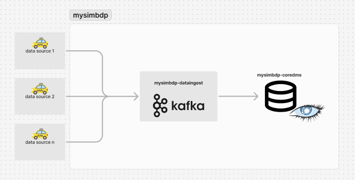
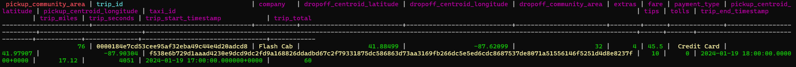
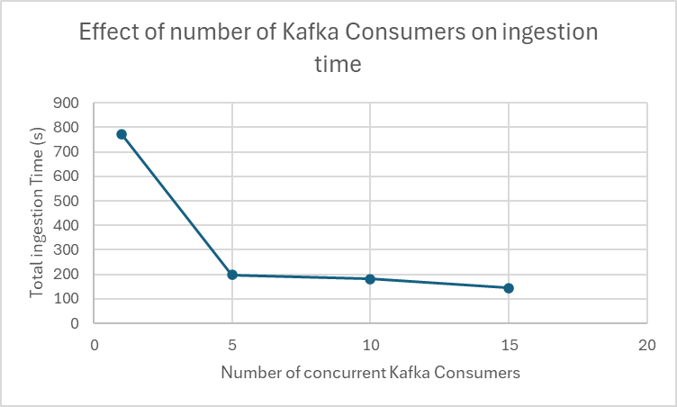
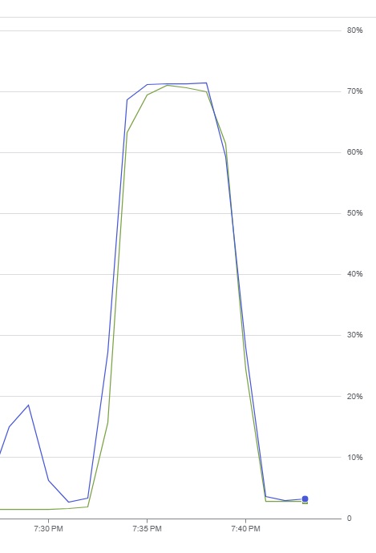
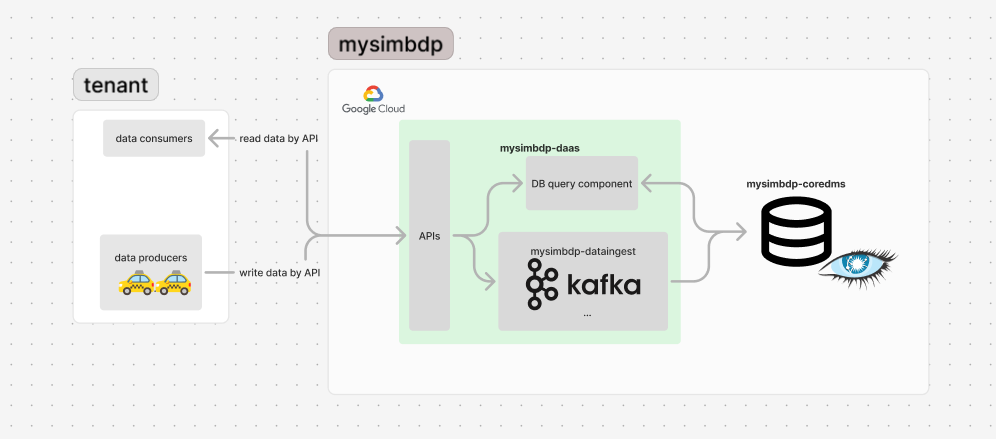

# Assignent 1 report - Building Your Big Data Platforms

## Part 1 - Design

### 1. Application domain, data & technologies

The application domain for this big data platform is transportation. The reason for this domain is the relevance to big data concepts. Global taxi services like Uber, Yango and Bolt are handling massive volumes of real-time data, while also for example cargo and aviation industries use real-time location tracking. The platform supports both structured and semi-structured data, allowing new fields/columns to be dynamically added to the data storage tables without strict enforcement on data formats. This flexibility is essential for handling IoT-generated data in transportation domain, as data unit structures may vary geologically and evolve over time.

Technology for the data storage component (mysimbdp-coredms) of the platform is chosen to be [Apache Cassandra](https://cassandra.apache.org/_/index.html), a distributed NoSQL database. Cassandra is designed for handling large volumes of data across multiple nodes. It offers scalability, high availability and fault tolerance, which are essential assets for a serving as a big data storage. Cassandra also excels in high-speed write operations, making it suitable for handling real-time data streams.

Tenant data sources (e.g. the IoT taxi trip data) are ingested into the data storage of the platform using Apache Kafka, distributed event streaming platform. Kafka is designed for handling high-throughput real-time data streams, suiting perfectly this platform's domain. Tenants send the generated data using Kafka Producers into the Kafka server this platform provides, using predetermined Kafka topics and configurations. The platform inserts the received data into the data storage.

The platform is designed to handle real-time data streams efficiently. Of the 4Vs of big data, this platform serves especially for Velocity: the platform is optimized to handle large amounts of data in real-time streams using technologies such as Kafka. The platform supports receiving up to 2600 rows of data in a second (part 2.5). This means if each tenant would send approximately 500 rows of data in a second, this platform would support 5 tenants with current deployment. The platform also has support for Variety and Veracity, as the data structure formats are not strictly enforced and the data is processed in real-time during the ingestion. The scalable data storage of the platform handles the Volume, as the amount of data gathered can grow huge. By addressing these concepts, this platform is designed to handle large scale data workloads.

### 2. Platform architecture & data ingestion pipeline

The platform consists of two components in this part:

* **Mysimbdp-dataingest**: this component is responsible for the ETL. The component ingests the source data from tenants data sources into the platform and inserts the data into the coredms. Dataingest ensures reliable data transmission and does the necessary simple data processing, including modifying data types and column names to match Cassandra table schemas.
* **Mysimbdp-coredms**: this component is responsible for managing and storing the data across multiple Cassandra nodes with replication.

The platform is deployed to Google Cloud Platform (GCP). The components are communicating in the shared GCP Virtual Private Network (VPC) with Kafka (TCP-protocol). The dataingest-component connects to the coredms using coredms VM port 9042, with the configured VM ip-address. The dataingest is listening to data on port 9092, which is the port tenant data Producers connect to.

Data ingestion pipeline:

Tenants use Kafka Producer Python library provided by [Confluent](https://developer.confluent.io/get-started/python/#introduction) to send the source data into mysimbdp-dataingest, which hosts a Kafka server and Kafka Consumer (by Confluent). The dataingest is listening on a specific ip and port, which are given to tenant. The consumer subscribes and listens to the relevant topics (predetermined with tenant) continuously. Upon receiving the raw data, the consumer parses, validates and transforms it and inserts the data into a corresponding Cassandra table of mysimbdp-coredms.

The services not developed to the platform at this point include external data processing and analytics components.
For example the taxi service provider tenant would want analysis about indemand location areas, which an analysis component could show. Additionally, proper security and logging (data lineage, metadata, VMs HW usage) mechanisms are not developed. There is also no component yet implemented for tenants to query the data they have stored.

### 3. Configuration of cluster of nodes in coredms & avoiding single point-of-failure

The coredms constains a Cassandra cluster with 4 nodes deployed across 2 data centers. This design ensures availability and fault tolerance: if one node goes down in a data center, there will be another node available to serve data in this DC and tenant data ingestions are not stopped. Additionally, even if an entire data center fails, there will still be nodes serving in the other data center left. Nodes are dependent only on nodes within same data center, meaning scaling up or down the data centers won’t affect other centers or nodes. This configuration provides good balance availability, fault tolerance and costs in this context. While adding more nodes and data centers would achieve even better availability and fault tolerance, it would also require more hardware in the cloud, raising up the platform costs.

The consistency level in Cassandra in chosen to be Quorum, which means majority of the replicas must acknowledge a write operation. It is a balance between performance and data consistency. Using a less strict consistency (e.g. ONE) would mean faster read and write operations for tenants, but the data could be stale or inconsistent. Using stronger consistency (e.g ALL) would ensure very strong consistency but lower the performance as writes and reads become slower to complete. To conclude, the coredms in configured to be a balance in tradeoffs between performance, costs and data consistency.

### 4. Data storage replication design

In this design, the replication factor for Cassandra is chosen to be 3, which means that each data unit will be replicated on three different nodes in the Cassandra cluster. For this replication to work, there will need to at least 4 Cassandra nodes deployed to ensure that data is replicated to 3 nodes even if one node fails and there are still multiple nodes left to serve the data. This replication ensures high availability and fault tolerance. The Cassandra cluster is configured to use NetworkTopologyStrategy for data distribution. In the configuration two replicas are chosen to be in the data center 1 and one replica in data center 2, which enchases also geographical redundancy.

Alternative replication option would be a replication factor of 4, meaning the data would copied to all the nodes. As the platform domain is transportation with real-time data streams, such a high level of redundancy is not needed, as missing few data units has a very little effect on the data analysis. Higher replication factor would also mean slower performance, or the need for more hardware meaning higher infrastructure costs. The chosen replication factor of 3 gives a good balance between data availability, fault tolerance and costs.

### 5. Platform deployment

The platform is deployed and hosted in Google Cloud Platform with two virtual machines, one for mysimbdp-dataingest and one for mysimbdp-coredms. The tenant data sources are expected to be geographically distributed as the domain is transportation (taxi trips etc), meaning that the data would be sent to this platforms Kafka server from different locations. The platform is designed for ingesting real-time data streams data row by row. Network bandwith in the platform hosted in GCP is 16Gbps between the platform components (dataingest, coredms) and 7Gbps between the platform and tenants. If one data row was 80 bytes of size, this would theoretically mean approximately 10 million rows of data in a second. The platforms hardware can not handle this much of data, but we can say the the platform network bandwidth will not be a bottleneck.

If there was only one tenant and it is located in the USA (e.g the Chicago Taxi Data), the platform would also be physically hosted on USA near Chicago in Google data centers. For multiple tenants located in multiple continents, the platform would also need to be distributed geographically. Additionally edge clouds could do some data processing first to enchase performance. The transportation data could also be first be sent to a tenants own server, and then forwarded to this platforms Kafka server.

Pros of deploying the platform/dataingest-component in cloud contain especially the scalability. As source data is coming in almost real-time, during high traffic peaks (huge events, holidays etc.) the number of Kafka brokers could be scaled up to ensure high availability and throughput. Additionally, during low traffic times (e.g. nighttime) dataingest could be scaled down to reduce cloud hosting costs. Hosting dataingest on a cloud service would also enable possibility to distribute the servers geographically across continents, enabling faster communication between geographically distributed tenants and the servers. Cloud services also enable monitoring and automation of components with less work.

Cons of deploying in the cloud contain the high costs of hosting the ingesting component and if the servers are not geographically distributed enough, there may be communication latencies with some tenants. There can also be issues with data regulation when storing data in different continents. Also energy efficiency of the hosting hardware infrastructure may vary.

## Part 2 - Implementation

### 1. Example data structure design

An example tenant would be a taxi service provider managing multiple taxi service companys located in Chicago, USA. The taxis of the taxi services produce data of the trips in similar structures.
The taxis will produce the raw data with the following attributes:

`Trip ID,Taxi ID, Trip Start Timestamp, Trip End Timestamp, Trip Seconds, Trip Miles, Pickup Census Tract, Dropoff Census Tract, Pickup Community Area, Dropoff Community Area, Fare, Tips, Tolls, Extras, Trip Total, Payment Type,  Company, Pickup Centroid Latitude, Pickup Centroid Longitude, Pickup Centroid Location, Dropoff Centroid Latitude, Dropoff Centroid Longitude, Dropoff Centroid Location`

The platform will ingest the raw data and do some simple data wrangling and drop some attributes. The attributes to skip are Pickup Census Tract, Dropoff Census Tract, Pickup Centroid Location,
Dropoff Centroid  Location. These values are produced by the IoT machines but are not important enough to be stored in the platform.

The final data unit to be stored in the platforms data storage is the following:

* Trip ID: text
* Taxi ID: text
* Trip Start Timestamp: timestamp
* Trip End Timestamp: timestamp
* Trip Seconds: int
* Trip Miles: float
* Pickup Community Area: float
* Dropoff Community Area: float
* Fare: float
* Tips: float
* Tolls: float
* Extras: float
* Trip Total: float
* Payment Type: text
* Company: text
* Pickup Centroid Latitude: double
* Pickup Centroid Longitude: double
* Dropoff Centroid Latitude: double
* Dropoff Centroid Longitude: double

The schema contains 19 attributes. The schema contains basic trip information: identifying of the trip and taxi, the time statistics of the trip, the trip length and pickup/dropoff points and cost information. Additionally, the schema contains payment type and taxi company providing the trip. The schema also contains exact coordinates of pickup and dropoff points for precise indemand area analysis. Other values especially important for varying analysis tasks are taxi company, trip time and length. Taxi company information analysis can be used for finding insights about specific taxi company strategies (e.g. why so little demand?). Trip time and length data analysis can enable for example allocating lower fuel consumption cars for longer trips. The mandatory values are trip id, taxi id, start/end timestamps, trip length, pickup/dropoff areas, payment total and the taxi company. The optional values are trip seconds (can also be calculated from timestamps), fare, tips, toll, extras (payment total is most important), payment type and the coordinates (pickup areas are more important for location analysis).

### 2. Data partitioning strategy

The taxi service provider tenant's taxi trip data will be partitioned across multiple Cassandra nodes using **Pickup Community Area** as the partitioning key.
This partitioning will distribute the data based by the geographical location of start of the taxi trip. The reason behind this design choice is performance of indemand area queries. All trips with the same staring location will be stored in the same node, meaning more efficient queries of taxi trips based on the location. This enables efficient analysis of in-demand areas
enabling the tenant to locate and allocate the taxis nearby for profit. Trip id is used as a clustering column in the Cassandra table, so duplicate trips would not be created
based on the pickup community area alone.

However, partitioning by the community area can lead to unequal node sizes, if some areas are very commonly used and some rarely. This could result in some nodes being overloaded and some
nodes being underused. This choice is a tradeoff between completely even distribution and efficient indemand queries of the tenant.

An alternative partitioning strategy would be using the trip id as the partitioning key. This would ensure equally distributed data, but it would mean slower queries on the pickup comminity areas, making the analysis less real-time.

The data storage is composed of 4 Cassandra nodes with a replication factor of 3. The data is partitioned by the pickup location and
each partition is replicated across 3 different Cassandra nodes in 2 data centers. This design gives fault tolerance and availability to the indemand area queries of the tenant.

3. Assume that you play the role of the tenant, emulate the data sources with the real selected dataset
and write a mysimbdp-dataingest that takes data from your selected sources and stores the data into
mysimbdp-coredms. Explain what would be the atomic data element/unit to be stored. Explain
possible consistency options for writing data in your mysimdbp-dataingest

### 3. Mysimbdp-dataingest implementation,

The example taxi service provider tenant's dataset is the [taxi trip data of Chicago](https://data.cityofchicago.org/Transportation/Taxi-Trips-2024-/ajtu-isnz/about_data).
The implementation for the mysimbdp-dataingest can be found on *code/mysimbdp-dataingest/*. The kafka_server holds containerized kafka server with 5 brokers. The consumer/ contains kafka_consumer.py which is a python script that holds implementation for creating kafka consumers using the server to consume source data and ingest it to the corresponding coredms Cassandra table.
A shell script start_consuming.sh can be used for running multiple concurrent consumers.

The implementation for example tenant is in *code/tenant/*. It contains a python script kafka_producer.py for simulating generation of source data and sending it to the platform using Kafka Producers. Shell script start_producing.sh can be used for running multiple parallel kafka producers.
The folder *data* contains python script create_samples.sh for reading rows from the taxi trip data of chicago and generating number of sample data set from it. Using multiple source data files we can simulate multiple parallel producers generating data.

The producer(s) reads the source data from the samples of taxi trip data of Chicago and send it to kafka server. An example row looks following:

``
Trip ID,Taxi ID,Trip Start Timestamp,Trip End Timestamp,Trip Seconds,Trip Miles,Pickup Census Tract,Dropoff Census Tract,Pickup Community Area,Dropoff Community Area,Fare,Tips,Tolls,Extras,Trip Total,Payment Type,Company,Pickup Centroid Latitude,Pickup Centroid Longitude,Pickup Centroid Location,Dropoff Centroid Latitude,Dropoff Centroid Longitude,Dropoff Centroid  Location
0000184e7cd53cee95af32eba49c44e4d20adcd8,f538e6b729d1aaad4230e9dcd9dc2fd9a168826ddadbd67c2f79331875dc586863d73aa3169fb266dc5e5ed6cdc8687537de8071a51556146f5251d4d8e8237f,01/19/2024 05:00:00 PM,01/19/2024 06:00:00 PM,4051,17.12,17031980000,17031320100,76,32,45.50,10.00,0.00,4.00,60.00,Credit Card,Flash Cab,41.97907082,-87.903039661,POINT (-87.9030396611 41.9790708201),41.884987192,-87.620992913,POINT (-87.6209929134 41.8849871918)
``

The final data unit to be stored after ingesting the source data and doing simple data processing is the following:

The consistency level in Cassandra means the number of replicas/nodes must acknowledge a read or write operation before it is succesful.
Consistency level can bet set for both read and write operations. The consistency level for both read and write is chosen to be Quorum,
which means out of all the replication nodes, majority must respond before the operation is succesful.
This means in this platform out of the 3 data replication nodes, 2 nodes must respond. This consistency level enables balance between availability and risk of data loss, and hence
is a good option for this domain.

Alternative consistency levels would be All and and One. All would mean that all 3 replication nodes must acknowledge the operation. In case of node failures
this would mean that the operation wont go through, which decreases the platforms availability. As the data domain is transportation and not, example financial transactions, this consistency level would be unnecessarily high. Consistency level of one would enable the fastest reads, but could return stale data.

1. Given your deployment environment, measure and show the performance (e.g., response time,
throughput, and failure) of the tests for 1,5, 10, .., n of concurrent mysimbdp-dataingest writing data
into mysimbdp-coredms with dierent speeds/velocities together with the change of the number of
nodes of mysimbdp-coredms. Indicate any performance dierences due to the choice of consistency
options. (1 point)

Avg. data produce velocity for each of these test case (runtime of a single producer): finished producing input data at 1738592753.3659682, total runtime: 80.86 s
(different log mechanism)
Each consumer polls for new messages every second

**Different number of data coming in and different number of kafka consumers:**

Number of consumers	At least as many partitions as consumers for parallelism. We use as 1.5x number of consumers
Kafka broker is a server that stores and serves messages. Brokers work together in a Kafka cluster.
Kafka replication factor is 3.

partitions: 15, so max 15 consumers can read

Each log file contains statistics about each concurrent kafka consumer's data ingestion separated by lines.

5 Kafka brokers, 4 Cassandra nodes (DC1: 2, DC2: 2, replication DC1: 2, DC2: 1), Consistency: Quorum, Kafka consumers poll every second

On average, a source data producer sent 10 000 rows of data to the mysimbdp-coredms in 80 seconds (125 rows/s). 30 Producers generated 3750 rows of data in a second.
Avg. data produce velocity for each of these test case (runtime of a single producer): finished producing input data at 1738592753.3659682, total runtime: 80.86 s

30 Kafka Producers producing 10 000 rows of data each, 1 Kafka Consumers
- log file: ingest0.log

30 Kafka Producers producing 10 000 rows of data each, 5 Kafka Consumers
- ingest1.log

30 Kafka Producers producing 10 000 rows of data each, 10 Kafka Consumers
- ingest2.log

30 Kafka Producers producing 10 000 rows of data each, 15 Kafka Consumers
- ingest3.log

We can see, that the most radical effect is when increasing the number of concurrent Kafka Consumers happens when increasing
from one to 5. After 5 consumers, adding more instances does not give any real boost when receiving 3750 rows of data in a second.

**Different poll time of consumers:**

Using 5 Kafka consumers to point out the effect of the polling time

5 Kafka brokers, 4 Cassandra nodes, Consistency: Quorum, 30 Kafka Producers producing 10 000 rows of data each (), 5 Kafka Consumers 
poll every second
- log1.log

poll every 0.1s
- log4.log
=> 10%? increase in speed

poll every 2s
- log5.log
=> not much difference to 1s poll time

poll every 4s
- log6.log

poll every 8s
- log7.log

No dramatic time differences. The changes in runtimes may be affected by network, latencies etc.
What we can say is, that in this case having a bit bigger poll interval can benefit the platform, as the CPU usage wont be so high.

[poll time](../poll_ingestion.png)

**Different write consistencies:**

5 Kafka brokers, 4 Cassandra nodes, 30 Kafka Producers producing 10 000 rows of data each, 5 Kafka Consumers poll every 1.0s

Consistency: Any
- a write is succesful if any node in the cluster accepts it.
- log8.log

Consistency: One
- a write is succesful if one replica (node which stores the replicated data) in the cluster accepts it.
- log9.log
 
Consistency: Quorum
- a write is succesful when majority of replicas in the cluster accept it.
- log1.log

Consistency: All
- a write is succesful only when all the replicas in the cluster have accepted it.
- log10.10

Consistency defines the level of guarantee on how many nodes in a cluster must acknowledge a read or write operation for it to be considered succesful.
Consistency options provide tradeoff between availability, latency and data consistency.

**Different number of Cassandra nodes:**

5 Kafka brokers, Consistency: Quorum, 30 Kafka Producers producing 10 000 rows of data each, 10 Kafka Consumers poll every 1s
esting the effect of data distribution and replication across different configurations.
CREATE KEYSPACE taxiServices WITH replication = {'class': 'NetworkTopologyStrategy', 'DC1': 2, 'DC2': 1} AND durable_writes = true;

4 Cassandra nodes (2 in DC1, 2 in DC2)
- log1.log
=> is there impact when one more node, on the distribution/replication => performance

5 Cassandra nodes (3 in DC1, 2 in DC2)
=> same replication, one more node still
-log11.log

6 Cassandra nodes (3 in DC1, 3 in DC2)
-log12.log

7 Cassandra nodes (3 in DC1, 3 in DC2, 1 in DC3)

When you increase the number of nodes in the Cassandra cluster, the data is distributed more widely. With more nodes, Cassandra has a better opportunity to distribute the write load across the cluster, leading to less congestion on any single node. This can result in higher throughput for writes, as the load is spread across more nodes.
=> load balancing

### 5. Test ingestion of lots of data

In this test we try the platform's performance when ingesting lots of data in real-time.

We had 50 producers generating 20 000 rows of input data concurrently (1M total rows) - average runtime of a producer was spproximately 380s (52 rows/s).
On total producers generated and send 50 * 52 = 2600 rows/s to the platform. The platform dataingest component had 15 concurrent Kafka Consumers reading the input data simultaneously.

From the **ingest_huge.log** we can see that each of the 15 Kafka consumers inserted approximately 90 rows per second to the coredms. In ingest3.log performance test, we had
30 Kafka Producers producing 10 000 rows of data each (300 000 rows) and 15 Kafka Consumers and the rows succesfully inserted / s was approx. 144. The throughput speed in the large data set decrease
was approximately 37.5 % compared to the smaller dataset. Number of Kafka errors stayed 0 in this test, meaning that if there was single node fails, the number of excess nodes
helped the components to stay running. Cassandra fails were must probably from the individual incorrect data types in source data as before.

The peak CPU usage of both dataingest and coredms VMs raised to up to little over 70 %.

We can see that both components are becoming a bottleneck in the same ratio when input data amount grows.
To prevent the dataingest-consumers and coredms cluster from getting overloaded and the VMs CPUs overload, we could scale both components horizontally. By using technologies like Kubernetes, we could add more parallel dataingest and coredms components to keep the throughput fast. Also some kind of mechanism would be needed to make sure that the dataingest does not
get too many messages and fail completely.

## Part 3 Extension

1. Using your mysimbdp-coredms, a single tenant can run mysimbdp-dataingest to create many
dierent databases/datasets. The tenant would like to record basic lineage of the ingested data,
explain what types of metadata about data lineage you would like to support and how would you do
this. Provide one example of a lineage data. (1 point)

### 1. Data lineage and metadata

The platform could support multiple types of metadata for the data ingested into it. An example of a data lineage for a taxi service provider which sends their raw
data to this platform's data ingestion would following:

The tenant information would be stored, containing which tenant and which user of tenant has stored specific data.
For example, when the tenant starts producing the source data by Kafka Producer from their server, the user who started the action
would be stored. Also the source data type would be stored, with the schema of the data units. Then the processing done by the mysimbdp-dataingest
would be stored, which could include ignoring unnecessary (if predetermined) columns, changing data types (e.g. timestamps, int to float) and data filtering.
Then the ingestion result data would be stored, which would contain total numbers of input data ingested, total number of succesful data storage inserts and
errors. Additionally, the ingestion start timestamp and end timestamps would be stored. Also the used Cassandra keyspace(s) and table(s) would be stored.

The data lineage could be stored in JSON format like:

{
  "tenant_id": "tenant_a",
  "user_id": "user_1",
  "source": {
    "schema": ["trip_id", "taxi_id", "trip_start_timestamp", "trip_end_timestamp", "trip_seconds",  
        "trip_miles", "pickup_community_area", "dropoff_community_area", "fare", "tips",  
        "tolls", "extras", "trip_total", "payment_type", "company",  
        "pickup_centroid_latitude", "pickup_centroid_longitude",  
        "dropoff_centroid_latitude", "dropoff_centroid_longitude"],
    "type": "csv"
  },
  "processing": {
    "trip_start_timestamp": "modify_to_timestamp",
    "trip_end_timestamp": "modify_to_timestamp",
    "trip_miles": "modify_to_int",
    "dropoff_centroid_latitude": "drop"
    "dropoff_centroid_longitude": "drop"
  },
  "ingestion_result": {
    "total_rows_processed": 10000,
    "total_rows_discarded": 0,
    "successful_db_inserts": 9990,
    "failed_db_inserts": 10,
    "success_rate": "99.9%",
    "rows_inserted_per_second": 555
  },
  "ingestion_start": "2025-02-04T20:00:15Z",
  "ingestion_end": "2025-02-04T22:00:00Z",
  "cassandra_keyspaces": ["taxiservices"],
  "cassandra_tables": ["trips"]
}

This kind of data lineage support would be implemented by recording the data ingestion statistics (similar to the logging part). Also the tenant user would
send some message to the platform that which user is starting the action. Then after specific time period where no messages have been ingested/stopped by the user, the ingestion
record would be stored as the JSON. The source data, data processing and ingestion result, keyspace and table statistics would be logged from the data-ignest component.
The data lineage would be stored in the coredms of the tenant, where they can fetch it from.

2. Assume that each of your tenants/users will need a dedicated mysimbdp-coredms. Design the data
schema of service and data discovery information for mysimbdp-coredms that can be published into
an existing registry (like ZooKeeper, consul or etcd) so that you can nd information about which
mysimbdp-coredms is for which tenants/users. (1 point)

### 2. Data schema of service and data discovery information

For managing multiple mysimbdp-coredms instances, the platform would need to handle and store the schema of service and data
discovery information for each tenant in a configuration synchronization service like Apache ZooKeeper. These kind of services
enable centralized and consistent way for managing configuration and metadata about multiple services like mysimbdp-coredms'.
A tenant's mysimbdp-coredms information would contain essential information about the tenant such as
tenant name, id and users and the corresponding coredms id. Information about the tenant specific coredms(s) would contain: number of cassandra nodes, data centers, replication factor, keyspaces, tables
Information about the VM instance running the coredms would contain the addresss (ip:port),
firewall rules (protocols accepted, ports etc), hardware specs (CPU, RAM etc) and the cost of the machine. Also metadata such as tenant creation date, location would be stored.
Also coredms status would be stored, including active, stopped, removed.

The tenant information could be stored in JSON like:

{
    "tenant_name": "taxi_service_provider_abc",
    "tenant_id": "abc123",
    "coredms_id": "dms_abc_123",
    "status": "active",
    "users": [
        {
            "user_id": "id123",
            "role": "admin"
        },
        {
            "user_id": "id456",
            "role": "user"
        }
    ],
    "databases": [
        {
            "keyspace:": "taxiservices",
            "tables": ["trips", "reviews"],
        }
    ],
    "db_nodes": 4,
    "replication": 3,
    "db_data_centers: ["DC1", "DC2"],
    "virtual_machine": {
        "ip": "127.0.0.1",
        "cassandra_port": 9042,
        "ports_listened_on": ["9042", "9042", "9044"],
        "protocols": ["http", "https"],
        "vm_cost_annual_euro": 10000,
        "cpu_cores": 4,
        "memory": 16,
        "disk": 400
    },
    "creation_date": "2025-02-04T20:00:15Z",
    "location": "USA"
}

3. Explain how you would change the implementation of mysimbdp-dataingest (in Part 2) to integrate a
service and data discovery feature (no implementation is required). (1 point)

## 3. How to integrate service and data discovery feature

Currently, mysimbdp-dataingest contains hardcoded environmental variables to use when connecting to the specific mysimbdp-coredms instance.
This means that the coredms instance VM ip and port are manually inserted, and cassandra keyspace and table where to store the data are manually inserted. The use of the tenant service and data discovery
feature would enable retrieving these values from the centralized configuration management service (e.g. ZooKeeper) and automatically inserting the correspoding coredms data into
mysimbdp-dataingest configurations. This way connecting dataingest component to coredms component could me automated.
This would be implemented in a way, where the platform would also host ZooKeeper service, and the dataingest would ask for the configurations from there.
Mysimbdp-dataingest would query for the corresponding coredms data by the tenant id, and the ZooKeeper service would return it, if values are right, for example status is active and
the tenant user is allowed for this action.
When dataingest receives new data from tenant data sources, it would first query the data by tenant id, and then if the source data matches the configurations in the tenant data,
the data is inserted.

4. Assume that you have to introduce a new key component, called mysimbdp-daas, of which APIs can
be called by external data producers/consumers to store/read data into/from mysimbdp-coredms.
This component is a platform-as-a-service. Tenants can get shared or dedicated instances of
mysimbdp-daas for their usage. Assume that now only mysimbdp-daas can read and write data into
mysimbdp-coredms, how would you change your mysimbdp-dataingest (in Part 2) to work with
mysimbdp-daas, draw the updated architecture of your mysimbdp? (1 point)

### 4. New component: Mysimbdp-daas

The mysimbdp-daas would be implemented as a platform-as-a-service inside the mysimbdp-platform. The source data ingestion would still be done
by the mysimdp-dataingest. The daas would provide APIs for tenants to use for ingesting data. The underlying technology would still be Kafka. 
The daas would also provide APIs for reading the data. This would require a new component for querying the coredms and returning the results to the API.

### 5. Hot space and cold space

For the taxi service provider tenant the data split to hot and cold data would be straightforward. The tenant could for example decide to split
the data based on the taxi trip timestamp. An example constraint would be if the taxi trip start timestamp
is older than 24 hours, it would be cold data. And vice versa if the trip data timestamp is inside 24 hours compared to this moment, it would be hot data.
This way we could store the hot data into separate tables, enabling more efficient queries for in-demand area analytics.
After 24 hours we can assume that the demand would not be probably the same anymore on the location, and the data would not be needed in this kind of queries anymore,
and could be inserted to cold space and removed from hot space.

We could implement this automatically in a way, where there are hot and cold Cassandra Clusters for the tenant. We could have a scheduled job running for example every hour,
and query the hot data tables based on timestamp and check which data are currently over the 24 hour line. Then these data units would be inserted into the cold cluster,
and removed from the hot cluster. If the constraint is that only trips that are inside the current date (e.g. 06.02.2025) are in hot space, we could query every day
at midnight and insert and remove the data of previous day.
