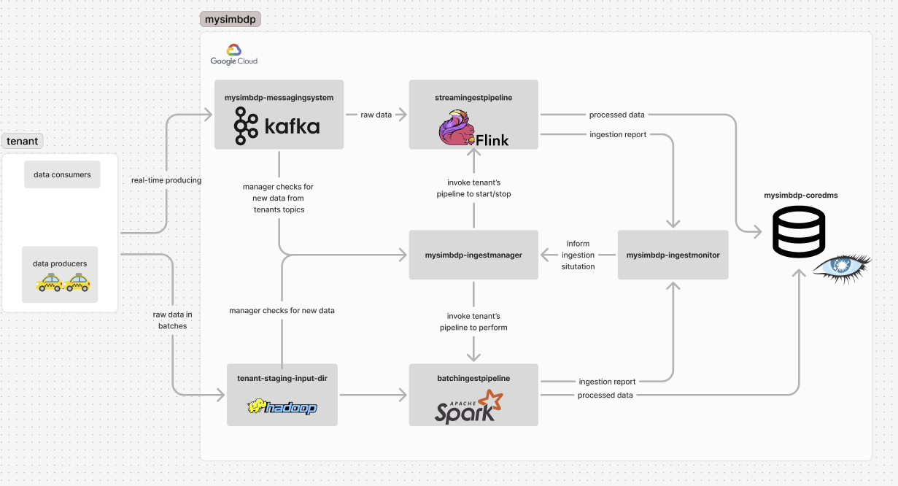

# Assignment 2 894931

This repository contains the implementations and reports of Big Data Platforms assignment 2.

From *reports/* you can find:

* Assignment-2-Report: the answers to the assignment questions
* Assignment-1-Deployment: instructions for running the platform locally

From *logs/* you can find the log files of the performance testing of the platform. Each log file is explained more in the assignment report.

From *data/* you can find sample of the Chicago taxi trip data set and a python script for generating multiple samples from the original set.

From *code/* you can find all the implementations of the platform:

* *mysimbdp-coredms*: contains cassandra cluster set up (from assignment 1)
* *mysimbdp-batchingest*: contains HDFS info, example tenant service agreements, batch ingestion manager and monitor
* *mysimbdp-streamingest*: contains messaging system (kafka cluster set up), tenant pipeline implementations, and stream ingestion monitor and manager
* *tenant*: contains example tenant implementations as with kafka producers

Each folder contains more information about itself.

Batch Ingestion and Processing architecture:

Stream Ingestion and Processing architecture:

Hybrid/Lambda architecture:

