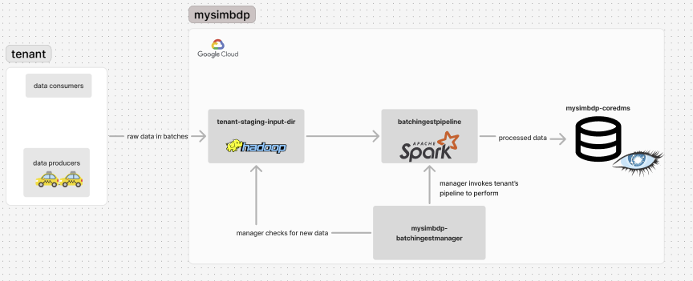
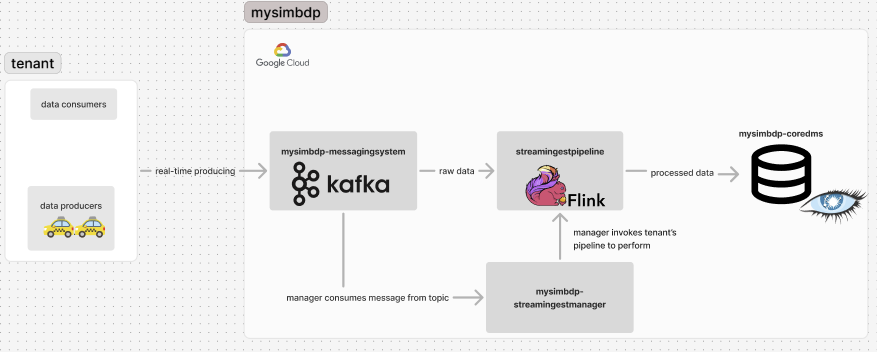
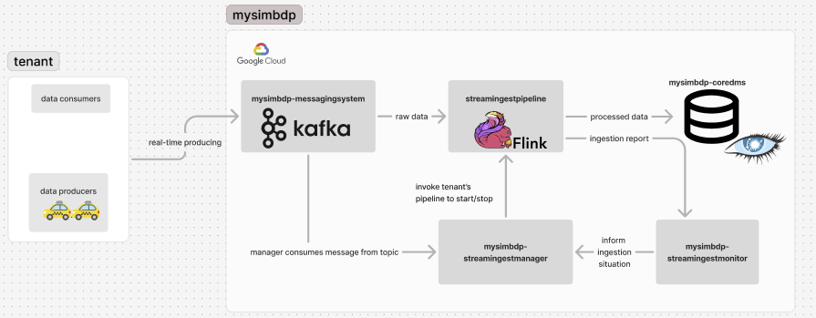
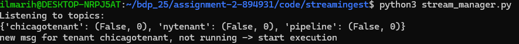
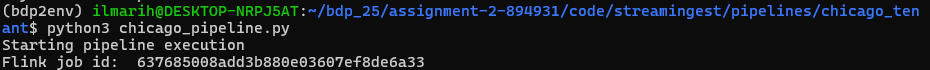
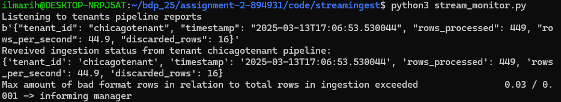
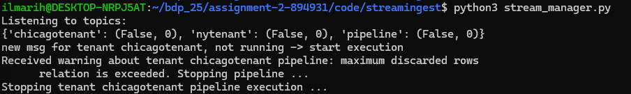
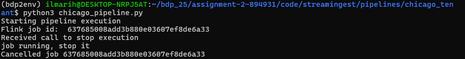

# Assignment 2 report - Working on Data Ingestion and Transformation

## Part 1 - Batch data ingestion and transformation

### 1.1 Tenant service agreement

This platform has different constraints for the platform usage defined individually in each tenant's service agreement. There are constrains for source data added to the platform. This way each tenant has different level of the platform, defined by their customer level. The service agreement is stored as an JSON file.

One service agreement constraing is the number of different input file types supported by the platform.. Minimum service supports only 1 file-format, such as CSV. With higher level service, the platform will support multiple source file formats, such as CSV, JSON, XML and txt. The number of different source file types supported means more freedom to the tenant and due depends on the service level.

Another service level quality constraint is data ingestion speed. This is implemented by different service agreement constraints. The service agreement holds an interval of time after which the platform checks if the tenant has added new input data to the staging input directory. Another constraint is the maximum amount of data that can be ingested on one run. After the limit is reached, the platforms halts for another specified interval of time, ingestion interval, before continuing the ingestion. Higher service level means shorter intervals and higher amount of maximum ingestion data and therefore faster ingestion speed. Defining the intervals and maximum amount of data for one ingestion based on the tenant service level is essential for the platform, as executing the tenant pipeline uses platform's recources, which causes infastructure costs. The ingestion interval is stored as seconds and maximum amount of data in megabytes.

Another critical service level constaint is the maximum storage of the platform's staging input directory. The service uses platform's memory and the max storage amount is due correlated to the service agreement level. The staging input directory max storage is stores as megabytes (MB).

The service agreement schema would also contain other needed values, such as tenant identification, the tenant's batch ingestion pipeline, which the platform executes and the corresponding staging input directory in the platform. In real production context the pipeline component would be stored in other form, e.g. some API.

The service agreement holds the following information:

* **id**: identification of the tenant
* **pipeline**: tenant specific data ingestion/processing pipeline
* **fileStorageLocation**: the HDFS staging input directory location of the tenant
* **coredmsKeyspace**: the keyspace of tenant in the data storage (Cassandra)
* **coredmsTable**: the table of the tenant in the data storage (Cassandra)
* **fileTypesSupported**: information about which file formats of input data are supported and which are not
* **maxStagingStorage**: maximum amount of storage of the tenant's staging input directory (in MB)
* **maxNumFiles**: maximum number of files the tenant's staging input directory holds
* **inputCheckInterval**: the amount of time (in seconds) the manager waits until checking for new input data to start pipeline execution
* **maxIngestionIntervalSize**: maximum amount of data that is ingested on one run (in MB)
* **ingestInterval**: the amount of time (in seconds) the manager waits to continue input data ingestion after reaching the maximum amount of data that is ingested on one run

Example service agreement schemas of two different tenants:

Lower service level with one input data format support, max staging dir storage of 10GB, maximum of 20 files, input data checking interval of one hour, maximum ingestion interval size of 100 MB and ingestion interval time of 10 minutes.

TODO: add example domains and why such agreement for each

```json
{
    "id": "tenant_chicago",
    "pipeline": "batch_ingest_pipeline.py",
    "fileStorageLocation": "/tenantChicagoTaxi",
    "coredmsKeyspace": "taxiservices",
    "coredmsTable": "trips",
    "fileTypesSupported": {
        "csv": true,
        "json": false,
        "txt": false,
        "xml": false
    },
    "maxStagingStorage": 10000.0,
    "maxNumFiles": 20,
    "inputCheckInterval": 3600,
    "maxIngestionIntervalSize": 100.0,
    "ingestInterval": 600
}
```

A bit higher service level with three input data type support, max staging dir storage of 1TB, maximum of 50 files and
ingestion interval of 1 minute.

```json
{
    "id": "tenantAbc",
    "pipeline": "abc_pipeline.py",
    "fileStorageLocation": "/tenantAviationCompany",
    "fileTypesSupported": {
        "csv": true,
        "json": true,
        "txt": true,
        "xml": false
    },
    "maxStorage": 1000000.0,
    "maxNumFiles": 50,
    "interval": 60
}
```

### 1.2 Batch Ingest Pipeline

To perform batch ingestion with this platform, each tenant will put their source data files into a staging file directory hosted by this platform. The technology for staging file directory is Hadoop Distributed File System (HDFS). Due to the distribution, HDFS is fault-tolerant and it provides high throughput data access to application data making it suitable technology for this component.

Each tenant has developed their own batch ingestion pipeline. The pipeline will take the tenant's source data
from the corresponding HDFS location, process the data and insert the processed data into the storage component
mysimbdp-coredms, which is provided by the platform.

Example implementation of batch ingestion pipeline can be found on *code/tenant/*. The main technology is Apache Spark, which is an engine for executing data engineering and processing large amounts of data. Spark contains ready made drivers for ingesting data from HDFS and inserting it to Apache Cassandra, which is the storage technology of this platform. The platform's batchingestmanager calls the tenant pipeline component, with the file to ingest being an input parameter. In the pipeline, fist a spark session is created, with connection to the tenant's corresponding Cassandra keyspace and table. Then the component reads the source data file and processes it by:

* removing unneeded values: Pickup Census Tract, Dropoff Census Tract, Pickup Centroid Location, Dropoff Centroid  Location
* transforming column keys from format "Trip ID" to format "trip_id"
* tranforming some column data types such as: trip_start_timestamp/end_timestamp from text to timestamp
* filling null values in pickup_community_area to -1.0

After the batch data processing the processed data is inserted into corresponding Cassandra table.

### 1.3 Batch Ingestion Manager

The platform contains a component for managing different tenant batch ingestion pipelines, *batchingestmanager*.
The manager is responsible for invoking the tenants pipelines to start the ingestion. The pipelines are a
black box for the manager, meaning that the manager is only responsible for starting the pipelines and does not
need any other information about the pipelines.

The manager retrieves the service level agreement information about each tenant in JSON form. The agreement
contains information about each tenant's ingestion interval in seconds. The manager is running continuosly, and
scheduling the pipelines. When the tenant's ingestion interval has ran, the manager checks the tenant's staging input directory location in the platforms HDFS from the service agreement. Then the manager checks for new files in the location. The manager uses the service level agreement to make sure that the tenant is acting according to the agreement. If the tenant has inserted source data into the staging directory with data types not being accepted in the service agreement, the manager will remove them. Also the manager checks that the maximum storage amount in the staging directory is not exceeded. If the limit is exceeded, the manager will remove files until the storage amount is under the limit. The manager also checks that the number of input files is not exceeding the limit, and removes files until amount is under the limit if needed. In real production platform, the insertion of new files exceeding the limits would be prevented.

Finally the manager will call the tenant's ingestion pipeline with each accepted file. After all the files are ingested, the manager waits for the interval time amout until checking for the tenant's source data files again.



### 1.4 Design for multi-tenancy

TODO: explain multi-tenancy model

In a real production platform, each tenant would have their own coredms instance running in the platform.
With new platform users the platform would increase infrastructure and when tenants are removed,
their instances would be deleted.

We tested the platform against two different tenants with different level service agreements. Both tenants used the same pipeline to emphasize the effect of the service agreement details. Both tenants also used the same input data.

In the first test, we measure the ingestion speed of the two different tenants, when they have different level service agreements. Both tenant 1 and tenant 2 have 10 files of 5 000 rows inserted into their corresponding staging file directories provided by the platform. One file has size of approximately 2 MB. Tenants have the same amount of input data, to point out the effect of maximum ingestion interval total data size defined in the unique service level agreement to ingestion speed.

Tenant 1 has higher level service agreement, and in this test case the tenant's maximum ingestion interval size limit is not reached. Tenant 2 has lower level agreement with stricter maximum intercal size, meaning after ingestion of 3 files, the manager will halt the tenant's pipeline execution for 60 seconds before continuing the ingestion of the input files. In this case the maximum storage and number of files service agreement details are not exceeded.

Tenant 1 service agreement:

```json
{
    "id": "tenant_chicago",
    "pipeline": "batch_ingest_pipeline.py",
    "fileStorageLocation": "/tenantChicagoTaxi",
    "coredmsKeyspace": "taxiservices",
    "coredmsTable": "trips",
    "fileTypesSupported": {
        "csv": true,
        "json": false,
        "txt": false,
        "xml": false
    },
    "maxStorage": 50.0,
    "maxIngestionIntervalSize": 25.0,
    "maxNumFiles": 20,
    "interval": 10
}
```

Tenant 2 service agreement:

```json
{
    "id": "example_tenant_123",
    "pipeline": "batch_ingest_pipeline.py",
    "fileStorageLocation": "/exampleTenant",
    "coredmsKeyspace": "exampletenant",
    "coredmsTable": "trips",
    "fileTypesSupported": {
        "csv": true,
        "json": false,
        "txt": false,
        "xml": false
    },
    "maxStorage": 50.0,
    "maxIngestionIntervalSize": 5.0,
    "maxNumFiles": 20,
    "interval": 60
}
```

Results:

| Tenant          | Total time (s)  | Ingestion speed (MB/s) |
|-----------------|-----------------|------------------------|
| 1               |  384            | 0.05                   |
| 2               |  571            | 0.04                   |

We can see that for the tenant 1 with higher level service agreement, ingestion speed was 33 % faster than the lower level agreement having tenant 2. As the input data contained 50 000 rows total, the corresponding ingestion speeds measured by rows are 130 rows/s and 88 rows/s. This test environment is rather minimal, but it indicates the impact of the service level agreement to the ingestion speed difference.

The full log files are *tenant_chicago_1741351815_ingestion.log* and *example_tenant_123_1741351815_ingestion.log*.

In the second test, we will violate the service level agreement constraints. During ingestion, tenant 2 will exceed the maximum input storage of the staging input directory defined to the tenant. From the log *tenant_chicago_1741351815_ingestion.log* we can see the error message, which tells that the tenant is breaking the service agreement of maximum staging input directory storage and the ingestion is not started.

```log
2025-03-07 15:11:59,930 - INFO - Statistics:
  *  Amount of files in tenant's staging input directory: 10
  *  Combined Storage Used: 113.63 /50.0 MB
2025-03-07 15:11:59,931 - WARNING - Tenant Service Agreement limit reached: storage limit exceeded
2025-03-07 15:11:59,931 - WARNING - Storage used: 113.625373 MB
2025-03-07 15:11:59,931 - WARNING - Storage limit: 50.0 MB
2025-03-07 15:11:59,931 - WARNING - Remove exceeding files to start ingestion.
```

In the third test, tenant 2 will break the service agreement of input data types supported. Tenant 2 agreement supports only csv-format, but tenant will insert txt-format file. The error message can be seen on log *example_tenant_123_1741353469_ingestion.log*

```log
2025-03-07 15:17:49,422 - INFO - Starting tenant example_tenant_123 pipeline execution ...
2025-03-07 15:17:49,468 - INFO - Files:
2025-03-07 15:17:49,483 - INFO - * fail.txt - 0.00 MB
2025-03-07 15:17:49,483 - WARNING - Tenant Service Agreement failure: input file type 'txt' not supported
2025-03-07 15:17:49,483 - WARNING - Removing file fail.txt
```

In this final part, we measure the maximum amount of data per this platform can ingest by increasing the batch file sizes while running ingestion on the two tenants. We will keep testing with 2 tenants to make the scenario more realistic, even though we could get higher ingest speed with only 1 tenant running.

**2 files of 25000 rows each (10 MB/file):**

The runtime of both tenants stayd approximately the same for each test, so we show only one.

| Rows of data | Total time (s)  | Ingestion speed (MB/s) |
|--------------|-----------------|------------------------|
| 50000        |  106            | 0.20                   |

logs:

* example_tenant_123_1741354437_ingestion.log
* tenant_chicago_1741354437_ingestion.log

**2 files of 35 000 rows each (15 MB/file):**

| Rows of data | Total time (s)  | Ingestion speed (MB/s) |
|--------------|-----------------|------------------------|
| 70000        |  116            | 0.25                   |

logs:

* example_tenant_123_1741354734_ingestion.log
* tenant_chicago_1741354734_ingestion.log

**2 files 45 000 rows each (19 MB/file):**

| Rows of data | Total time (s)  | Ingestion speed (MB/s) |
|--------------|-----------------|------------------------|
| 90000        |  122            | 0.30                   |

logs:

* tenant_chicago_1741354983_ingestion.log
* example_tenant_123_1741354983_ingestion.log

The final test of 2 files of 50 000 rows (22 MB/file) resulted in the platform halting so we found the limit.
When running the platform locally with one machine (HDFS, Spark, Cassandra), and two parallel tenants,
the maximum amount of data per second we can ingest by batch ingestion is approximately
0.30 MB/s (738 rows/s) per tenant. We can assume that this would approximately double up when running with only one tenant. We can assume that this would also linearly decrease with the amount of tenants increasing.

### 1.5 Logging

Define metrics:

* why do we log these info, why are the data needed?
* how are the log data used to manage service quality (platform not too slow etc)
* are the logging data metrics defined in the service agreement (we promise that this is minimum ingest speed etc)

The platform logs multiple factors by the batch ingestion manager, which runs the tenants ingestion pipelines. When the manager invokes the tenant's pipeline execution, the corresponding log file is initialized with the tenant id. Then the manager checks for new files from the tenant's staging input directory. The manager logs the following general information aspects:

* info if no new input files are found
* names of files found and file sizes
* combined storage used of the staging input directory

The manager logs the following service agreement violation aspects:

* input file amount limit exceeded
* storage limit exceeded
* input file type not supported

The manager logs the following ingestion statistics aspects:

* time taken to ingest each file
* ingested file is removed from staging directory
* number of files ingested
* total ingestion time (s)
* total ingestion size (MB)
* ingestion speed (MB/s)

The manager stores the log file in the platform. In real production environment, the file would be stored to a e.g. a database.

The information logged could be used for various ways. For example, if the service level agreement would contain some level of promised ingestion speed (e.g. in MB/s), the data could be used to monitor that the platform is fulfilling the promised ingestion speed of tenant. The log information of service level agreement violations could be used to monitor tenant actions, and if the violations would continue the platform could perform some corresponding actions (e.g. suspend data ingestion, notify the tenant). The logs also contain possible platform errors, such as HDFS errors. These informations could be used to fix possible bugs and so on.

This is an example log file showing succesful data ingestion of a tenant:

```log
2025-03-07 14:50:15,257 - INFO - ######################################################
2025-03-07 14:50:15,257 - INFO - Starting tenant example_tenant_123 pipeline execution ...
2025-03-07 14:50:15,286 - INFO - Files:
2025-03-07 14:50:15,302 - INFO - * sample0.csv - 2.06 MB
2025-03-07 14:50:15,313 - INFO - * sample1.csv - 2.06 MB
2025-03-07 14:50:15,324 - INFO - * sample2.csv - 2.07 MB
2025-03-07 14:50:15,336 - INFO - * sample3.csv - 2.07 MB
2025-03-07 14:50:15,350 - INFO - * sample4.csv - 2.06 MB
2025-03-07 14:50:15,360 - INFO - * sample5.csv - 2.07 MB
2025-03-07 14:50:15,371 - INFO - * sample6.csv - 2.07 MB
2025-03-07 14:50:15,383 - INFO - * sample7.csv - 2.07 MB
2025-03-07 14:50:15,392 - INFO - * sample8.csv - 2.06 MB
2025-03-07 14:50:15,402 - INFO - * sample9.csv - 2.07 MB
2025-03-07 14:50:15,403 - INFO - Statistics:
  *  Amount of files in tenant's staging input directory: 10
  *  Combined Storage Used: 20.66 /50.0 MB
2025-03-07 14:50:15,403 - INFO - Ingesting sample0.csv
2025-03-07 14:50:55,489 - INFO - Ingested sample0.csv. Time taken: 40.06s. Deleted from staging dir.
2025-03-07 14:50:55,490 - INFO - Ingesting sample1.csv
2025-03-07 14:51:37,792 - INFO - Ingested sample1.csv. Time taken: 42.27s. Deleted from staging dir.
2025-03-07 14:51:37,795 - INFO - Ingesting sample2.csv
2025-03-07 14:52:19,463 - INFO - Ingested sample2.csv. Time taken: 41.64s. Deleted from staging dir.
2025-03-07 14:52:19,464 - INFO - Ingestion interval limit reached. Starting ingestion again after 60 seconds ...
2025-03-07 14:53:19,519 - INFO - Ingesting sample3.csv
2025-03-07 14:53:56,893 - INFO - Ingested sample3.csv. Time taken: 37.31s. Deleted from staging dir.
2025-03-07 14:53:56,894 - INFO - Ingesting sample4.csv
2025-03-07 14:54:39,813 - INFO - Ingested sample4.csv. Time taken: 42.88s. Deleted from staging dir.
2025-03-07 14:54:39,816 - INFO - Ingesting sample5.csv
2025-03-07 14:55:30,367 - INFO - Ingested sample5.csv. Time taken: 50.51s. Deleted from staging dir.
2025-03-07 14:55:30,370 - INFO - Ingestion interval limit reached. Starting ingestion again after 60 seconds ...
2025-03-07 14:56:30,431 - INFO - Ingesting sample6.csv
2025-03-07 14:57:12,387 - INFO - Ingested sample6.csv. Time taken: 41.92s. Deleted from staging dir.
2025-03-07 14:57:12,388 - INFO - Ingesting sample7.csv
2025-03-07 14:57:44,161 - INFO - Ingested sample7.csv. Time taken: 31.72s. Deleted from staging dir.
2025-03-07 14:57:44,162 - INFO - Ingesting sample8.csv
2025-03-07 14:58:15,480 - INFO - Ingested sample8.csv. Time taken: 31.29s. Deleted from staging dir.
2025-03-07 14:58:15,480 - INFO - Ingestion interval limit reached. Starting ingestion again after 60 seconds ...
2025-03-07 14:59:15,534 - INFO - Ingesting sample9.csv
2025-03-07 14:59:46,517 - INFO - Ingested sample9.csv. Time taken: 30.92s. Deleted from staging dir.
2025-03-07 14:59:46,517 - INFO - Ingestion ended, amount of files ingested: 10
2025-03-07 14:59:46,518 - INFO - --------------------------------
2025-03-07 14:59:46,518 - INFO - Total ingestion time: 571.11 s
2025-03-07 14:59:46,518 - INFO - Total ingestion size: 20.66 MB
2025-03-07 14:59:46,518 - INFO - Ingestion speed: 0.04 MB/s
```

The log file contains information about the input data and ingestion statistics.

This is an example log file of an ingestion canceled because service level agreement violation of tenant:

```log
2025-03-07 15:11:59,729 - INFO - ######################################################
2025-03-07 15:11:59,730 - INFO - Starting tenant example_tenant_123 pipeline execution ...
2025-03-07 15:11:59,800 - INFO - Files:
2025-03-07 15:11:59,817 - INFO - * sample0.csv - 20.66 MB
2025-03-07 15:11:59,830 - INFO - * sample1.csv - 20.66 MB
2025-03-07 15:11:59,846 - INFO - * sample2.csv - 20.66 MB
2025-03-07 15:11:59,861 - INFO - * sample3.csv - 20.65 MB
2025-03-07 15:11:59,874 - INFO - * sample4.csv - 20.66 MB
2025-03-07 15:11:59,887 - INFO - * sample5.csv - 2.07 MB
2025-03-07 15:11:59,898 - INFO - * sample6.csv - 2.07 MB
2025-03-07 15:11:59,908 - INFO - * sample7.csv - 2.07 MB
2025-03-07 15:11:59,919 - INFO - * sample8.csv - 2.06 MB
2025-03-07 15:11:59,930 - INFO - * sample9.csv - 2.07 MB
2025-03-07 15:11:59,930 - INFO - Statistics:
  *  Amount of files in tenant's staging input directory: 10
  *  Combined Storage Used: 113.63 /50.0 MB
2025-03-07 15:11:59,931 - WARNING - Tenant Service Agreement limit reached: storage limit exceeded
2025-03-07 15:11:59,931 - WARNING - Storage used: 113.625373 MB
2025-03-07 15:11:59,931 - WARNING - Storage limit: 50.0 MB
2025-03-07 15:11:59,931 - WARNING - Remove exceeding files to start ingestion.
2025-03-07 15:11:59,931 - INFO - --------------------------------
2025-03-07 15:11:59,931 - INFO - Total ingestion time: 0.00 s
2025-03-07 15:11:59,931 - INFO - Total ingestion size: 0.00 MB
2025-03-07 15:11:59,931 - INFO - Checking for new files after 60 seconds ...
2025-03-07 15:12:59,981 - INFO - ######################################################
2025-03-07 15:12:59,981 - INFO - Starting tenant example_tenant_123 pipeline execution ...
2025-03-07 15:13:00,041 - INFO - Files:
2025-03-07 15:13:00,057 - INFO - * sample0.csv - 20.66 MB
2025-03-07 15:13:00,057 - INFO - Statistics:
  *  Amount of files in tenant's staging input directory: 1
  *  Combined Storage Used: 20.66 /50.0 MB
2025-03-07 15:13:00,057 - INFO - Ingesting sample0.csv
2025-03-07 15:13:58,377 - INFO - Ingested sample0.csv. Time taken: 58.29s. Deleted from staging dir.
2025-03-07 15:13:58,378 - INFO - Ingestion ended, amount of files ingested: 1
2025-03-07 15:13:58,378 - INFO - --------------------------------
2025-03-07 15:13:58,378 - INFO - Total ingestion time: 58.32 s
2025-03-07 15:13:58,378 - INFO - Total ingestion size: 20.66 MB
2025-03-07 15:13:58,379 - INFO - Ingestion speed: 0.35 MB/s
2025-03-07 15:13:58,379 - INFO - Ingestion ended, amount of files ingested: 1
```

This log shows the agreement violation of staging input directory maximum storage exceeded. The tenant has then removed files, and when the manager has invoked the ingestion again, the limit is not exceeded anymore and the ingestion is started.

## Part 2 - Near real-time data ingestion and transformation

### 2.1 Stream Ingestion

The stream ingestion provided by this platform consists of a messaging system, stream ingestion pipeline and a data storage. Messaging system technology is Apache Kafka. The Kafka topics are defined in the cluster, and the tenant's produce real-time data into those topics. Stream processing technology is Apache Flink, which is good for tracking running aggregations and detecting anomalies. Flink is used to transform the raw source data into data storage compatible format. Flink provides stateful computations with streaming data at large scale, high performance and low latency. Data storage component is Cassandra, as before.

In real-time ingestion provided by the platform some components of the platform are dedicated to individual tenants and some parts are shared between all tenants. The messaging system is shared between all tenants in the multi-tenancy model. The platform hosts an Kafka server with multiple brokers. The tenant-specific Kafka topics are added to the Kafka broker cluster alongside the other topics of tenants.

Individually dedicated parts of the platform are the stream ingestions pipeline and the data storage. The stream ingestion pipeline is developed by the tenant itself and the platform invokes the execution of the pipeline. Pipelines are added and removed based on pay-per-use principle of the platform. The data storage components (coredms), Cassandra clusters, are also dedicated to individual tenants. Each tenant has their own data storage component running on it's own virtual machine in the platform infrastructure.

### 2.2 Stream Ingestion Manager

The platform contains a component stream ingestion manager, which is responsible for starting and stopping stream ingestion pipeline instances on-demand. The manager is listening to all the topics of tenants in the messaging system Kafka cluster. When a tenant produces new messages to a topic, the manager consumes the message and starts the tenant specific stream ingestion pipeline. The pipeline then ingests the real-time data stream and stores the data into tenant specific Cassandra table. The manager is constantly, during a specific time interval, consuming for new messages. The manager keeps information about which tenant pipelines are running and which are not, and how long has it been since the last message to a tenant topic. When a new message is consumed by the manager, the manager checks if the tenant pipeline is already running. If it is not, then the manager invokes the pipeline by producing a Kafka message to a topic which the pipeline listens to for start/stop actions. Example message to start pipeline: {"action": "start"}. When a limit of time of last inbound message is exceeded, the manager produces a stop pipeline message to the specific pipeline. The manager impelentation can be found on */code/streamingest/stream_manager.py*

The stream ingestion pipeline is a blackbox to the platform, meaning that the pipeline must follow a specific model to be able to be integrated to the platform. To succesfully develop the pipeline, the tenant must implement the following logic. The pipeline must consume data from a kafka topic determined for the pipeline's start/stop actions. The pipeline must start after consuming a start-message, and stop after consuming a stop-message. The pipeline must consume data from the specific Kafka topic of the tenant. The pipeline must transform the raw data into format compatible with the Cassandra table of the tenant and insert the data into the table. The pipeline must be a Flink job, which can be given to the Flink cluster of the platform to perform.



### 2.3 Stream Ingestion Pipeline

We have developed two different tenant stream ingestion pipelines. The pipeline techonology is Apache Flink, which consumes the raw source data from Kafka topic, transforms it and stores the processed data into Cassandra table. The pipelines initialize a Kafka source and read the input data as a string. The input data is then turned into JSON object and all the possible NaN values are transformed into Null-format, which is compatible with Cassandra.

For tenant 1 (chicago taxi), the trip start and end strings are turned into timestamps and unneeded values Pickup Census Tract, Dropoff Census Tract, Pickup Centroid Location, Dropoff Centroid Location are dropped. Then the remaining data is inserted into Cassandra data storage.

The input data must hold the following message structure schema (with possible missing values):

```json
{
  "Trip ID": "0000184e7cd53cee95af32eba49c44e4d20adcd8",
  "Taxi ID": "f538e6b729d1aaad4230e9dcd9dc2fd9a168826ddadbd67c2f79331875dc586863d73aa3169fb266dc5e5ed6cdc8687537de8071a51556146f5251d4d8e8237f", 
  "Trip Start Timestamp": "2024-01-19T17:00:00Z", 
  "Trip End Timestamp": "2024-01-19T18:00:00Z", 
  "Trip Seconds": 4051, 
  "Trip Miles": 17.12, 
  "Pickup Census Tract": 17031980000, 
  "Dropoff Census Tract": 17031320100, 
  "Pickup Community Area": 76, 
  "Dropoff Community Area": 32, 
  "Fare": 45.5, 
  "Tips": 10.0, 
  "Tolls": 0.0, 
  "Extras": 4.0, 
  "Trip Total": 60.0, 
  "Payment Type": "Credit Card", 
  "Company": "Flash Cab", 
  "Pickup Centroid Latitude": 41.97907082, 
  "Pickup Centroid Longitude": -87.903039661, 
  "Pickup Centroid Location": "POINT (-87.9030396611 41.9790708201)", 
  "Dropoff Centroid Latitude": 41.884987192, 
  "Dropoff Centroid Longitude": -87.620992913, 
  "Dropoff Centroid  Location": "POINT (-87.6209929134 41.8849871918)"
}
```

The transformed data inserted into Cassandra is in the following format (input data has NaNs):

```python
(6, '000072ee076c9038868e239ca54185eb43959db0', 'Flash Cab', None, None, None, 0.0, 33.75, 'Cash', 41.944226601, -87.655998182, 'e51e2c30caec952b40b8329a68b498e18ce8a1f40fa75c71e425e9426db562ac617b0a28e1c69f5c579048f75a43a2dc066c17448ab65f5016acca10558df3ed', 0.0, 0.0, datetime.datetime(2024, 1, 28, 15, 0), 12.7, 1749, datetime.datetime(2024, 1, 28, 14, 30), 33.75)
```

For tenant 2 (ny taxi), the trip start and end strings are turned into timestamps and unneeded values removed congestion_surcharge, improvement_surcharge and store_and_fwd_flag are dropped. Then the remaining data is inserted into Cassandra data storage.

The input data must hold the following message structure schema (with possible missing values):

```json
{
  "VendorID": 2,
  "tpep_pickup_datetime": "2024-01-01 00:50:05",
  "tpep_dropoff_datetime": "2024-01-01 01:25:09", 
  "passenger_count": 1, 
  "trip_distance": 4.08, 
  "RatecodeID": 1, 
  "store_and_fwd_flag": "N", 
  "PULocationID": 48, 
  "DOLocationID": 87, 
  "payment_type": 2, 
  "fare_amount": 31.0, 
  "extra": 1.0, 
  "mta_tax": 0.5, 
  "tip_amount": 0.0, 
  "tolls_amount": 0.0, 
  "improvement_surcharge": 1.0, 
  "total_amount": 36.0, 
  "congestion_surcharge": 2.5, 
  "Airport_fee": 0.0
  }
```

The transformed data inserted into Cassandra is in the following format:

```python
(2, "2024-01-01 03:51:53", "2024-01-01 04:18:37", 2, 4.230000019073486, 1, 255, 198, 2, 25.399999618530273, 1.0, 0.5, 0.0, 0.0, 27.899999618530273, 0.0)
```

We tested the stream ingestion performance with the two tenants producing streaming data. We run the tenant producers locally for approximately 4 minutes, with data sent to the platform's messaging system in 0.1 second intervals. The statistics were following:

Chicago taxi tenant:

```log
2025-03-12 09:41:25,338 - INFO - chicagotenant - Stream ingestion statistics:
2025-03-12 09:41:25,339 - INFO - Ingestion started at: 2025-03-12 09:36:32
2025-03-12 09:41:25,339 - INFO - Ingestion ended at: 2025-03-12 09:41:25
2025-03-12 09:41:25,339 - INFO - Total ingestion time: 232.80 s
2025-03-12 09:41:25,339 - INFO - Total number of rows inserted: 19443
2025-03-12 09:41:25,339 - INFO - Total ingestion size: 933.264 kB
2025-03-12 09:41:25,339 - INFO - Ingestion speed: 4.01 kB/s
2025-03-12 09:41:25,339 - INFO - Number of rows not inserted due to format not matching schema: 557
```

Ny taxi tenant:

```log
2025-03-12 09:41:25,688 - INFO - nytenant - Stream ingestion statistics:
2025-03-12 09:41:25,688 - INFO - Ingestion started at: 2025-03-12 09:36:31
2025-03-12 09:41:25,688 - INFO - Ingestion ended at: 2025-03-12 09:41:25
2025-03-12 09:41:25,688 - INFO - Total ingestion time: 233.78 s
2025-03-12 09:41:25,688 - INFO - Total number of rows inserted: 12905
2025-03-12 09:41:25,688 - INFO - Total ingestion size: 619.44 kB
2025-03-12 09:41:25,688 - INFO - Ingestion speed: 2.65 kB/s
2025-03-12 09:41:25,688 - INFO - Number of rows not inserted due to format not matching schema: 0
```

Chicago taxi tenant ingestion was a bit faster, with possible reasons being, producer slowness, network latency, pipeline data transformation efficiency, different database structures (different primary keys, ...) etc. Chicago pipeline ingested data approximately 83 rows a second while ny tenant ingested 55 rows a second. Chicago pipeline discarded 557 input data rows, because of data storage primary key values missing. Ny tenant input data was completely in correct format and no row was discarded.

Log files:

* logs/stream/ny_ingestion.log
* logs/stream/chicago_ingestion.log

We also conducted performance testing with chicago tenant streaming pipeline with large-scale streaming. We produced approximately 100 000 rows of data with the data being read in batches from a large input file and sent to the platform as fast as possible. The performance metrics were following:

```log
2025-03-12 10:03:41,281 - INFO - chicagotenant - Stream ingestion statistics:
2025-03-12 10:03:41,282 - INFO - Ingestion started at: 2025-03-12 09:46:15
2025-03-12 10:03:41,282 - INFO - Ingestion ended at: 2025-03-12 10:03:41
2025-03-12 10:03:41,282 - INFO - Total ingestion time: 985.79 s
2025-03-12 10:03:41,282 - INFO - Total number of rows inserted: 108871
2025-03-12 10:03:41,282 - INFO - Total ingestion size: 5225.808 kB
2025-03-12 10:03:41,282 - INFO - Ingestion speed: 5.30 kB/s
2025-03-12 10:03:41,282 - INFO - Number of rows not inserted due to format not matching schema: 3454
```

The ingestion took approximately 16 minutes, and 108 871 rows were inserted. 3454 rows were discarded due to mismatching format. Total ingestion size in 16 minutes was 5.2 MB. Ingestion speed raised higher than in the previous tests, as we only had one tenant pipeline running.

### 2.4 Stream Ingestion Monitor

The platform has a component stream ingestion monitor, which watches over the performance of stream ingestion pipeline instances. The pipelines report the data processing performance, with average ingestion time, total ingestion size and number of messages received/inserted. The pipelines send two kind of metrics to the monitor. The pipelines send ingestion status metrics in 10 second intervals, which contain tenant id, timestamp, number of rows processed, rows processed per seconds and number of discarded rows. The monitor component could use these reports for monitoring the system performance and tenant actions, and based on the information take actions such as scale components. Also as the discarded rows are produced to monitor in real-time, the monitor could take actions based on some explicitely set limits, such as 100 discarded rows in 10 seconds.



Example message:

```json
{"tenant_id": "chicagotenant", "timestamp": "2025-03-13T17:06:53.530044", "rows_processed": 449, "rows_per_second": 44.9, "discarded_rows": 16}
```

The pipelines also send a total ingestion report to a specific Kafka topic the monitor is listening to, after pipeline execution stop has been called. The report contains information for:

* identification of tenant (based on the topic)
* ingestion start time
* ingestion end time
* total ingestion time
* number of messages ingested
* total ingestion size
* average ingestion time/speed (messages/rows/data ingested per second)

Example message:

```json
{
  "tenant_id": "nytenant",
  "start_time": "2025-03-12 09:14:21",
  "end_time": "2025-03-12 09:16:52",
  "total_time": 91.77,
  "total_rows": 5500,
  "total_size": 260,
  "ingestion_speed": 2.88
}
```

Total ingestion size is stored as kilobytes and ingestion speed as kilobytes per second. The monitor creates the final execution report based on the ingestion statistics and discarded rows data. The monitor produces and stores a log file of the total ingestion metrics in the following format: 

```log
2025-03-12 10:03:41,281 - INFO - chicagotenant - Stream ingestion statistics:
2025-03-12 10:03:41,282 - INFO - Ingestion started at: 2025-03-12 09:46:15
2025-03-12 10:03:41,282 - INFO - Ingestion ended at: 2025-03-12 10:03:41
2025-03-12 10:03:41,282 - INFO - Total ingestion time: 985.79 s
2025-03-12 10:03:41,282 - INFO - Total number of rows inserted: 108871
2025-03-12 10:03:41,282 - INFO - Total ingestion size: 5225.808 kB
2025-03-12 10:03:41,282 - INFO - Ingestion speed: 5.30 kB/s
2025-03-12 10:03:41,282 - INFO - Number of rows not inserted due to format not matching schema: 3454
```

### 2.5 Stream ingestion pipeline actions based on ingestion metrics

The stream ingestion monitor component overwatches the performance of ingestion components. The monitor is consuming messages from Kafka topics specified for each tenant pipeline reporting. The monitor implementation can be found on locaiton *code/streamingest/stream_monitor.py*. The monitor informes the stream manager if the report execution is showing alarming statistics. Each tenant has a unique configuration which determines the pipeline execution limits to follow. The configuration is in following format:

```json
{
    "minimumIngestionSpeed": 2,
    "minRowsProcessed": 10,
    "maxDiscardedRowsRelation": 0.01
}
```

The configurations contains limit for minimum ingestion speed in kilobytes per second. The value is needed for making sure that the pipeline is performing as expected for the tenant. For example, if we know that a tenant should be producing 10 kB every second, but ingestion speeed is below the 2, something is wrong. Minimum rows inserted means the lower limit of rows inserted during one execution run. If we know that tenant sends always a batch of data at a time, this can be higher than 1. Otherwise, it should be at least one, to make sure that when ingestion is started, at least one unit data is really ingested. The final, maximum discarded rows relation stores the information about how many data units consumed where discarded on relation to total data consumed. If the relation exceeds the limit, the platform acts accordingly.

The monitor will inform the manager about the following problems:

**Maximum number of rows discarded is exceeded**

```json
{
  "tenant": "nytenant",
  "warning": "maxDiscardedRowsRelation"
}
```

When manager gets this ingestion result message, it will stop the pipeline. The platform could also send an alert to the tenant.

**Minimum number of rows inserted is below the limit**

```json
{
  "tenant": "nytenant",
  "warning": "minRowsInserted"
}
```

Numbers of rows inserted is less than a specific set threshold. For example, if the tenant configuration tells that this tenant should produce continuosly, this could indicate that something is wrong with the pipeline. When manager receives this message, it will restart the tenant ingestion pipeline by sending stop and start messages to it. In a real production environment, the manager could scale the pipeline component horizontally or up.

**Performance is below Minimum Ingestion Speed**

```json
{
  "tenant": "nytenant",
  "warning": "minimumIngestionSpeed"
}
```

Ingestion speed is below a specific set threshold. This could indicate problems in the pipeline execution or data storage performance. The manager restarts the pipeline when receiving this status message.

The following pictures the flow when monitor receives an ingestion status report which and realizes that the relation of rows discarded is exceeding the limit of tenant:

Manager is listening to tenants topics, receives a message and starts the corresponding tenant ingestion pipeline execution.


Pipeline execution is started, pipeline sends metrics to monitor


Monitor receives metrics and realizes that the maximum amount of rows discarded in one inteerval (10s) of ingestion is exceeded. The limit is 0.001 (0.1 % of messages), and amount is 0.03. Monitor sends warning message to manager.


Manager receives the warning message and stops the pipeline execution.


The pipeline execution is stopped.


## Part 3 - Integration and Extension

### 3.1 Batch ingestion logging

### 3.2 Stream ingestion to multiple data sinks

### 3.3 Data encryption

### 3.4 Quality of data

### 3.5 Multiple batch ingestion pipelines of a tenant