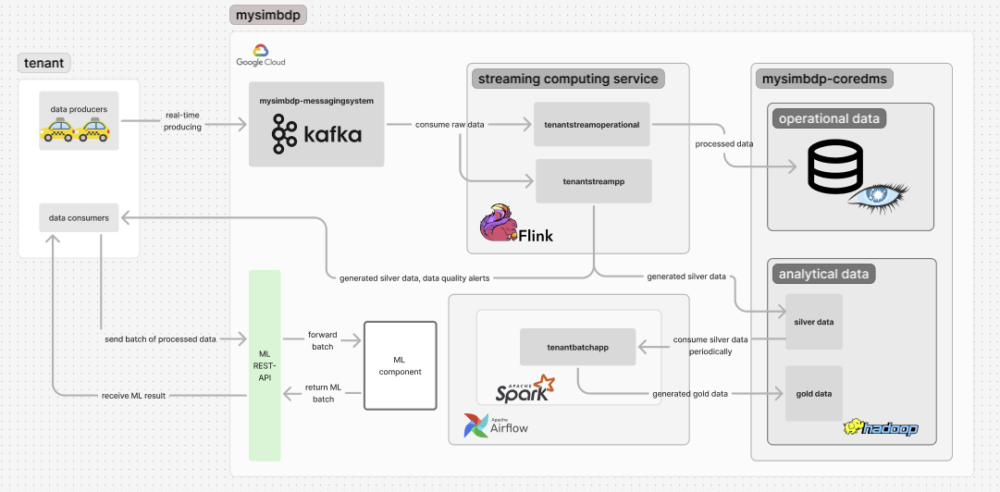
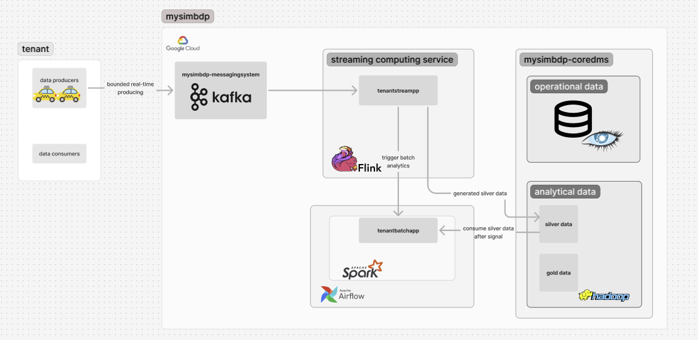
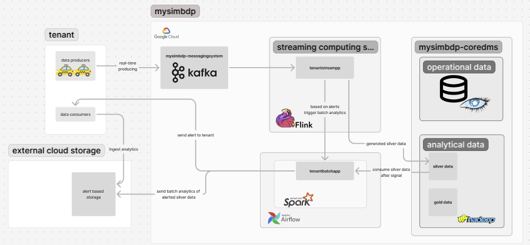

# Assignment 3 Report - Stream and Batch Analytics

## Part 1 - Design for streaming analytics

### 1.1 Dataset for streaming analytics

We are using the same dataset as previously used in this platform, the [2024 Chicago Taxi Trip data](https://data.cityofchicago.org/Transportation/Taxi-Trips-2024-/ajtu-isnz/about_data). The data contains 23 columns, including information about trip start and end times, trip distance, pickup and dropoff locations, taxi ID and total trip cost. The dataset is suitable for streaming data analytics as it can be used to simulate data streaming of taxi trips, which is a domain that generates continuous high-volume data in real time and can highly benefit from streaming analytics. The data requires immediate processing and insights to optimize the taxi business. For example, Uber handles very high volumes of data streams every day and has engineered their in-house streaming analytics platform called AthenaX to utilize the streaming data. The dataset contains potential streaming and batch (historical) analytics possibilities, which can be used to optimize the business of the taxi service provider tenant.

The component **tenantstreamapp** analyzes raw streaming data from the tenants. The component ingests raw taxi trip data from Kafka producers and produces *silver data*, which is by cleansing the data by removing invalid records e.g. without essential values. The trips are aggregated by location and time. The streaming analytics this implemenation generates is real-time on-demand analysis, where analyzing trip pickup locations would enable dynamic pricing per areas. The component would identify high-demand areas in real-time. Other analytics that could be generated contain average number of trips per vehicle, aggregated total fares, estimated hourly revenue per vehicle. The silver data is generated to csv files and the data sink is HDFS. Even better, more big-data-compatible data format would be parquet, but for simplicity we use csv.

The batch streaming analytics component is **batchstreamapp** uses workflow model and analyzes the historical silver data outputted by streaming analytics to produce *gold data*. The component processes historical data periodically to generate gold data by aggreagating the silver data results based on the geographical pickup location area. The component analyzes larger time scale information from the silver data, with analytics for example about geographical demand areas per week days. The gold data is also stored to HDFS. The gold data contains more detailed analytics of the ondemand areas.

The workflow model is the following. Tenant streaming analytics component produces silver data continuously. The component aggreagates the number taxi data trips per pickup location are over a specific time period and generates the silver data. The batch streaming analytics component schedules periodic processing of the silver data. It performs more complex aggregations and statistical analysis and generates gold data as insights and reports. For example, if the streaming application generates silver data of number of taxi trips per area over time of 1 hour, the batch application can be scheduled to perform batch analytics every day. Then the batch application would aggregate each hour's results and generate number of trips per area per day for more insights.

### 1.2 Messaging system and stream analytics settings

The streaming analytics component handles streaming data, which can be either keyed or non-keyed. Keyed data means that each data record is associated with a key, allowing grouping, partitioning and stateful processing. With keyeing, the streaming data can be partitioned and processed in parallel. Non-keyed data means that the data is handled as indepentent records, which enables simpler storage but less efficient partitioning and aggregations.

As keyed data allows parallel processing and grouping the data, we key the streaming data by the pickup location. This allows us to enable real-time aggregations per geographical location and generate silver data based on the analytics. Then batch analytics component can more efficiently query the silver data from HDFS to produce gold data based on the demand analytics. If the input data is missing the key, pickup community area, the data is ignored.

Message delivery guarantee means the assurance the messaging system provides about the delivery and processing of messages. Different levels of guarantees ensure that messages are reliably delivered and not lost, in certain ways. Message guarantees are the job of the messaging system, and processing guarantees are the job of the stream processing components. Message delivery guarantees include exactly once, at least once, at most once. At most once -guarantee means that the message might be not delivered at all, but no duplicate messages is possible. It is good option when duplicate processing is costly/unnecessary, such as logging. At least once -guarantee means that the message delivery is guaranteed, but it might me delivered multiple times in case of errors meaning duplicate data. It is suitable when message loss cannot be tolerated. Exactly once -guarantee is the strictest, as it ensures no message loss and no duplicates. It is used in financial transactions.

In our case, we will use the at exactly once -guarantee. It means that each message is processed exactly once, ensuring the analytical silver data correctness. It also means that in case of errors or failures, data records could be lost. We chose this guarantee, because we want to avoid duplicate data, which would corrupt the silver data and cause misleading conclusions. Missing occasional records is not so important in this case.

### 1.3 Data times and windows

The data pipeline in the platform contains several unique times associated with data. One time element is the event time, which means the time the message is produced. This time is automatically stored in the data record with as the Trip Start Timestamp contains it. Other time element is the time the message is entered into the system. One time element is the time when the data is processed. Because in streaming analytics we are interested in amount of trips per geographical area per some time unit, we use the **trip start timestamp** as data timestamp in stream processing to aggregate the data.

In stream processing, windows are used to group the data for processing in time-bound chunks. As streams keep producing events indefinitely, windows allow us to divide this continuous flow of data into manageable discrete frames and then process them like batches. Window is a chuch of data.

There are different types of windows, with sliding and tumbling windows being the feasible possibilites in this context. Tumbling window defines a fixed-size, non-overlapping window of data. Once a window is complete, the system moves to the next, window slides forward by the window size. E.g. with 10 minute tumbling window, data would be grouped from 00:00 to 09:59, with next group being 10:00 to 19:59. Used for calculating aggregations of events over fixed time intervals. Sliding window is also a fixed-size window, but it slides over the stream at regural intervals, i.e. windows overlap. A sliding window with a slide of 30 seconds would capture the data from 0:00 to 0:59, 0:30 to 1:29, 1:00 to 1:59. Sliding windows are used for e.g. tracking moving averages, such as computing average temperature in the last 5 minutes, updating every minute.

As we want to calculate aggregations of taxi trips over fixed time intervals, we are using tumbling window. We are using tumbling windows of 30 minutes. This means that we generate analytics containing information about number of taxi trips per geographical area over 30 minutes. We use allowed lateness of 5 minutes, meaning that incoming late data is aggregated to the results, if it less than 5 minutes late (e.g. window of 13:00 - 13:30, trip with start time of 13:10 comes in at 13:33, and is still aggregated). After the 30 minutes + lateness, the resulting data is stored in the HDFS silver data storage as csv, with each row corresponding to one area. This 30 minutes window is long enough time to generate meaningful analytics, but not too long to miss the on-demand area peaks. We use tumbling window instead of sliding window, because sliding windows could create misleading analytics if some trips are calculated to two windows. Sliding window be configured to ensure this doesn't happen, but for simplicity and because tumbling window works well for this case, we will stick with it.

Out-of-order data records could be caused the taxi trip IoT device failures, network failures etc. This is expected, as the data is coming from distributed sources with unreliable networks. A watermark is a progress marker for stream processing that helps the system decide when to move forward to avoid waiting indefinetely for out-of-order events. It allows the system to process a late event. As we are calculating amount of trips per area over time we will be using watermarks. The watermark acts as a threshold that marks the oldest event we will still process even if the event is late. The watermark associated to data records is the taxi trip start time, as we use the window based on it. We will allow lateness of 5 minutes. Watermarks are used to make sure that old, late data arriving to the streaming analytics component does not end in any aggregations and corrupt the resulting analytical data.

### 1.4 Performance metrics of streaming analytics

There are several important performance metris for streaming analytics for the taxi service provider tenant. An essential metric is event throughput. It is measured by the number of events processed per second per window by the streaming analytics application, indicating how efficiently the system can handle the incoming taxi trip streaming data. The tenant streaming analytics component implemented with Kafka calculates these metrics. This metric is useful for the platform, as it can indicate performance and possible slowness of the data processing.

Another important metric is data quality. It is measured by the relation of source data matching the enforced schema and data mismatching the schema. It is measured as decimal, e.g. with 1000 total records, 950 records matching schema and 50 records not matching, the data quality of this window would be logged as 0.95. This metrics is used to monitor the quality of the data and perform actions based on it. If the quality is under some agreed configuration with the tenant, we would send the silver data straight to the tenant for analysing. This metric is most useful for the tenant, as it can indicate if they have some problems with producing the data.

Alongside these essential metrics, we will log amount of records ingested per window, and the pickup area and timestamp errors, which cause the data to be discarded from analytics. We also log the number of late data, and send them back to tenant for further analysis.

Other usual useful metrics are bandwidth (amount of data processed per unit time) and response time (end-to-end latency). Bandwidth could be calculated by Kafka consumer metrics or Flink's built-in metrics. Response time could be computed by recording time when record inserts the streaming analytics component and the time when the record inserted in to HDFS. Generation of these two important metrics is skipped due to lack of time and we will cope with the data processing time.

### 1.5 Architecture of streaming analytics service

The platform contains messaging system, of which technology is Apache Kafka. This component is reused from previous implementations. Tenants produce data to the platform by sending data records using Kafka Producers. The messaging system component contains Kafka cluster, to which the tenants producers send data for analytics.

The streaming computing service of the platform is implemented with technology choice of Apache Flink, which is extremely efficient for tracking running aggregations and detecting anomalies. In real scenario, the streaming computing service would run a Flink cluster, and the tenantstreamapp would a Flink job, which is executed in the platforms Flink cluster. In this case for simplicity, the tenantstreamapp is flink job, which is executed in flink python environment.

The core data management system (coredms) contains two separate data storage components; one for operational data and one for analytical data. The operational data storage is Cassandra cluster, as previously in this platform. The analytical data storage is Hadoop Distributed File System (HDFS). In real scenario a data lake would be more suitable choice for analytical data, but for simplicity we will use HDFS, which is efficient for handling large data and supporting batch analysis. The HDFS storage system is separated into two storages, silver and gold data. Tenantbatchapp is the component, which runs batch data analytics of the silver data and produces gold data. 

Apache Airflow is used for orchestrating the workflow, scheduling the periodic running of the tenantbatchapp.


*Note that in the picture there are tenantstreamoperational (from assignment 2) and operational data storage, but these are not used in this streaming analytics part implementation.*

The workflow is the following. Tenants produce real time data with Kafka producers producing data into the messaging system. The tenants streaming application Flink job is running continuosly and consuming the streaming data of the tenant. The tenantstreamapp processes the data by cleaning and transforming it, and producing silver data, i.e. running aggregations of taxi trips per area over time (30 minute window) on the data. The produced silver data is sent to the tenant in real-time with Kafka and stored to the analytical data storage HDFS silver data storage. There could be specific condition under where the silver data is sent to tenant, such as specific limit for number of trips per area, so we would not sent every silver data unit. For simplicity, we assume the tenant wants all the calculated silver data, and makes decisions based on them on their own behalf. The streaming application component also calculates metrics such as data quality, and based on configurations, sends alert to the tenant about the data quality. For example, if we would have set data quality limit to 0.8 (relation of good rows to all rows), and the calculated quality would be lower, we would send alert to tenant by Kafka. The Tenantbatchapp runs periodically and consumes the silver data, generates gold data from it and stores the gold data into analytical data HDFS gold data storage.

## Part 2 - Implementation of streaming analytics

### 2.1 Streaming analytics application

The tenantstreamapp is the component which generates the analytical silver data from the source data stream. The implementation can be found from *code/tenantstreampapp/tenantstreampp.py*.

Input streaming data has the following schema:

```cs
{
  "Trip ID": string,
  "Taxi ID": string, 
  "Trip Start Timestamp": timestamp, 
  "Trip End Timestamp": timestamp, 
  "Trip Seconds": int, 
  "Trip Miles": float, 
  "Pickup Census Tract": int, 
  "Dropoff Census Tract": int, 
  "Pickup Community Area": int, 
  "Dropoff Community Area": int, 
  "Fare": float, 
  "Tips": float, 
  "Tolls": float, 
  "Extras": float, 
  "Trip Total": float, 
  "Payment Type": string, 
  "Company": string, 
  "Pickup Centroid Latitude": float, 
  "Pickup Centroid Longitude": float, 
  "Pickup Centroid Location": string, 
  "Dropoff Centroid Latitude": float, 
  "Dropoff Centroid Longitude": float, 
  "Dropoff Centroid  Location": string
}
```

The trip end timestamp is 0, as we dont yet know when does the trip end, as this is just the notification that the trip has started.

For the tenantstreamapp to be able to correctly generate the analytics from the streaming data, the input data must contain the following values. Pickup community area is essential, as it is used for the main analytics, which is the number of trips per pickup area over time. Obviously, the trip start time is also crucial. Other value used for the analytics is the trip total fare, but it is not enforced, as the main on-demand analytics can be generated without the trip costs. The times are expected to be in format "2025-03-27T09:59:22Z", from where it is assigned as the timestamp and changed to integer timestamp format.

The generated output analytics silver data is in following format:

| pickup location  | amount of trips | total fares | window start  | window end    |
|------------------|-----------------|-------------|---------------|---------------|
|   32             | 7               | 252.50      | 1743076720000 | 1743076720000 |
| 2                | 2               | 22.15       | 1743076720000 | 1743076720000 |

The data is inserted into the silver data storage and send to the tenant without the headers. We assume that the tenant is familiar with the silver data schema when consuming the data. The batch analytics component is implemented in a way that it knows the schema also.

The input data from Kafka producers is serialized into bytes. The tenantstreamapp Flink application deserealizes the data into string format, without enforcing any schema at this point. Then the tenantstreamapp validates the schema, by checking if the data contains the needed values. If trip total is missing, it is simply inserted to 0. After generating the analytics over the tumbling window, the resulting Flink Row-format data is serialized into string-format, and inserted into the HDFS silver data storage, and send to the tenant.

The logic of the streaming component is the following. After ingesting the source data from Kafka topic (in other words, after some data unit is sent), the record is assigned a timestamp for windowing. The timestamp is the trip start time, which should be really close to current time. If the data arrives late (e.g. after 10 minutes after start tiem), the data is ignored from the analytics. In the window (e.g. 30 minutes), every taxi trip started from that time is aggregated, with total fares aggregated also. The window accepts late data of 5 minutes, which it still aggregates. Then the aggregated silver data is sent to tenant. Component also calculates data quality and processing metrics. Processing metrics are logged to platform.

The generated silver data is sent to the tenant in real-time manner after each window. The data is sent using Kafka, assuming that the tenant has some component for consuming the data. The tenant would consume the analytical silver data and visualize it in some analytics component for performing business actions based on the data. The streaming analytics component also sends alert to the tenant if the data quality is under predefined configuration value. For example, if the tenant has set the data quality minimum to be 0.9, and in a window the result is lower than the limit, the platform sends Kafka message to the tenant containing information about the data quality being lower than expected. We also sent all the late data to tenant, for simplicity leaving the responsibility of making actions based on that data themselves.

### 2.2 Tenantbatchapp

The tenant implementation for batch analytics is the tenantbatchapp component, which is a Spark job. The implementation can be found from *code/tenantbatchapp/tenantbatchapp.py*. The component takes as input the generated silver data and produces gold data, which is more defined analytical data. The component sums up the fares and number of trips of the silver data. The batch analytics service provided by the platform is implemented with Apache Spark, which is a distributed computing framework for fast and large-scale data processing, especially for batch workloads. The platform hosts a Spark processing engine, and the tenantbatchapps are executed by submitting the application as Spark job to the platform engine. The tenantbatchapp is ran periodically. The component consumes all the latest generated silver data from the HDFS silver data storage. An example configuration could be that tenantstreamapp produces silver data records, which contain taxi trips statistics of an 1 hour window of different locations. Then the batch analytics component could consume the generated silver data every 24 hours, generating more detailed taxi trip statistics, enabling more in-depth, long term analysis.

The batch analytics component workflow is the following. First the platform checks for new untouchable input silver data from HDFS silver data storage. If new data is not found, the platform will stop the workflow exetution, and wait for predefined time interval, before starting the workflow again. In this small scale context, we will halt for 1 minute, but in production the interval could be for example from 10 minutes to 1 hour. If new input data is found, the workflow stores the file locations, and moves the execution to the tenantbatchapp-component, which gets the input files. Then the tenantbatchapp job is submitted to the Spark engine with the input files locations. After the batch analytics component has produced the gold data, the final workflow step begins. In this step the platform modifies the processed silver data file names to include a mark, that the file is processed. The file name will be transformed from "silverdata.csv" to "silverdata_processed.csv". This last step makes sure that the tenantbatchapp does not process the same silver data twice with duplicated data and produce incorrect, misleading analytics.

The underlying workflow orchestrator is implemented with Apache Airflow, which is a platform for automating and managing data pipelines. Airflow works by concepts of directed acyclic graphs with each task containing possible dependencies to others. The batch analytics workflow is defined as Airflow DAG, and it is scheduled to run every minute. Again, of course, in a real production environment this schedule would be different.

### 2.3 Performance testing

The test environment for testing the streaming analytics contains tenant data producers, tenantstreamapp, coredms analytical data storage HDFS for silver (and gold data). The streaming data is simulated by reading the Chicago Taxi Trip data and sending data row by row to the Kafka topic. As we want to simulate on demand analytics of taxi trips, we will modify the Chicago data in a way, that the trip start time is current time and end time is 0, as the taxi trip has just started.

As the main focus of this testing is the streaming analytics, we will not be storing the operational data into Cassandra data storage, and we will not be performing the batch analytics.

We have the following platform configuration:

* 1 kafka brokers
* topic partioined into 1
* replication factor of 1
* flink job parallellism of 1
* tumbling window of 1 minute
* tumbling window allowed lateness 15 seconds
* timestamp allowed lateness 1 minute

We are using limited computing power because of local testing.

For testing, we will use tumbling windows of 1 minutes, with window input data allowed lateness being 15 seconds and record timestamp lateness of 1 minute. This means that if the data arrives more than 15 seconds later than the timestamp (trip start datetime), the data is discarded from window and if it arrives later than 1 minute it is discarded totally. The log files of each test case can be founf from *logs/tests/*

**Test 1:**

We will start the testing by using 1 producer producing record of data every second. The following is the log file containing metrics of single window:

|window|records per window|records processed per second|rows discarded|data quality|pickup area errors|timestamp errors|
|-----|----------|-----------|---------------|---------------|-------------|------------|
|1743261840000|57|0.9649122807017544|2|0.95|2|0|

CPU and memory usage both rose up approximately 10 %. We can see that the number of records processed in the window is what expected, as the window is 60 seconds long and we produced 60 messages in 60 seconds.

**Test 2:**

In the seconds test, we had one data producer producing two messages per second.

Resulted metrics:

| Window        | Records per Window | Records Processed per Second | Rows Discarded | Data Quality | Pickup Area Errors | Timestamp Errors |
|--------------|-------------------|-----------------------------|---------------|--------------|--------------------|----------------|
| 1743263880000 | 114               | 1.9                         | 6             | 0.9473684210526316 | 6                  | 0              |

Again, CPU and memory usage both rose up approximately 10 %. The metrics are what we expected on behalf of the records processed per window. Data processing speed (records processed per second), was 0.95, relative to the input data (1.9 data units processed per 2 consumed in a second)

**Test 3:**

In this test we had one data producer producing 10 messages a second.

The resulting metrics:

| Window        | Records per Window | Records Processed per Second | Rows Discarded | Data Quality        | Pickup Area Errors | Timestamp Errors |
|--------------|-------------------|-----------------------------|---------------|----------------------|--------------------|----------------|
| 1743264420000 | 545               | 9.083333333333334           | 20            | 0.963302752293578    | 20                 | 0              |

CPU and memory usage again rose both again the 10 % familiar to us already. What we can see from the metrics, is the increasing processing latency of the streaming application, as the window is missing approximately 10 % of the records it could contain based on the data producing. Now the relative percentage of processing per consuming was 0.983. This can also be caused by Kafka latencies.

**Test 4**:

In this test we had five data producers, each producing 10 messages a second (total 50 msg /s).

Metrics were following

| Window        | Records per Window | Records Processed per Second | Rows Discarded | Data Quality        | Pickup Area Errors | Timestamp Errors |
|--------------|-------------------|-----------------------------|---------------|----------------------|--------------------|----------------|
| 1743264720000 | 2752              | 45.86666666666667           | 72            | 0.9738372093023255   | 72                 | 0              |

CPU usage raised by 20 %, and memory approximately 15 %. The relative processing speed compared to data consuming was approximately 0.917 (45.866/50). As a side note, the data is starting to show meaningful statistics for analytics:

Most taxi trips per area:

| pickup location  | amount of trips | total fares | start          | end            |
|-----|----------|-----------|---------------|---------------|
|8|497|7125|1743264720000|1743264780000|
|32|411|6057|1743264720000|1743264780000|

Opposed to lowest:

| pickup location  | amount of trips | total fares | start          | end            |
|-----|----------|-----------|---------------|---------------|
|14|1|31.25|1743264840000|1743264900000|

**Test 5:**

In this test we had five data producers producing 20 messages a second (total 100 msg /s).

Metrics were following:

| Window        | Records per Window | Records Processed per Second | Rows Discarded | Data Quality        | Pickup Area Errors | Timestamp Errors |
|--------------|-------------------|-----------------------------|---------------|----------------------|--------------------|----------------|
| 1743265020000 | 4063              | 67.71666666666667           | 112           | 0.9724341619492985   | 112                | 0              |

CPU usage rose 50 %, and memory usage 20 %. We are starting to see the platform starting to slow down with this amount of data coming in. The relation of record procession speed compared to data ingestion is now only 0.68 (67.7 / 100), which is 74 % of the relation when ingesting 50 messages a second.

**Test 6:**

In this test we had five data producers producing 30 messages a second (total 150 msg /s).

Resulting metrics:

| Window        | Records per Window | Records Processed per Second | Rows Discarded | Data Quality        | Pickup Area Errors | Timestamp Errors |
|--------------|-------------------|-----------------------------|---------------|----------------------|--------------------|----------------|
|1743279300000 | 5360|89.33333333333333 |149 |0.9722014925373135 |149 | 0|

CPU and memory usage rose approximately 50 % again, with the usage amount waving a lot. Now the processing speed relative to data consuming was only 0.595. We can see that the platform is starting to decrease a lot in the streaming analytics data processing when amount of data consumed per second increases this high.

**Test 7:**

In this final test we had 5 data producers producing data without sleep. Aftering producing for a little over 2 minutes, the platform started to halt. As we are running locally, we cannot say which component was the first to freeze. It is Kafka or the Flink. But, because HDFS contains only 2 silver data files, we can assume that the flink job freezed as it should have started writing to the third file as the third window was started.

The CPU raised up to 100 %. Memory raised only 10 %.

In this kind of small simulated test environment where the tests were run for couple of minutes, not very detailed analytics can be made (can't take into account real time of trip, events in the city, weather etc.), but this shows that if the silver data was for example for 15 minutes of trips, the data would contain useful information for analytics. Also because we tested the whole platform locally, it is hard to measure the resource (CPU, memory, ...) usage of the streaming component, because the computer we are running these tests on has many other processes running at the same time, such as the data producing. These tests cases still give us some indication about how the platform streaming analytics processing speed decreases with the speed of data coming to the platform increasing.

### 2.4 Handling of bad data

In this testing, we are testing behaviour as we are generating bad data to the platform. As the analytical data needs pickup location area and trip start timestamp, we will simulate situtation where wrong data is sent to the platform in different amounts. As the streaming analytics component is made in a secure way, all the data it needs (pickupp location, timestamps) are verified to be in the input data. If the input data is missing those or they are in wrong format, the component will ignore the record. The log files of these tests can be found from *logs/wrong_data/*.

**Test 1:**

In the first test we will send data to the platform that is missing pickup location area, which is the key of analytics data produced. We are using one data producer and sending 1 message a second.

Resulting metrics:

| Window        | Records per Window | Records Processed per Second | Rows Discarded | Data Quality        | Pickup Area Errors | Timestamp Errors |
|--------------|-------------------|-----------------------------|---------------|----------------------|--------------------|----------------|
| 1743266100000 | 44                | 0.7333333333333333          | 10            | 0.7727272727272727   | 10                 | 0              |

We can see that 10 rows are discarded, and each of those are from the pickup area error. We produced 60 messages in 60 seconds, while the streaming component processed 44. The reason for this can be various, but is propably Kafka related.

**Test 2:**

In this test we will send data that has pickup location as int instead of string.

| Window        | Records per Window | Records Processed per Second | Rows Discarded | Data Quality        | Pickup Area Errors | Timestamp Errors |
|--------------|-------------------|-----------------------------|---------------|----------------------|--------------------|----------------|
| 1743266520000 | 23                | 0.38333333333333336         | 2             | 0.9130434782608696   | 2                  | 0              |

We can see that the 2 rows discarded were both from pickup area errors.

**Test 3:**

In this test we will send data where every second record has no pickup area location

| Window        | Records per Window | Records Processed per Second | Rows Discarded | Data Quality        | Pickup Area Errors | Timestamp Errors |
|--------------|-------------------|-----------------------------|---------------|----------------------|--------------------|----------------|
| 1743266880000 | 58                | 0.9666666666666667          | 29            | 0.5                  | 29                 | 0              |

We can see that even though every second record is missing, pickup area location, a crucial value, the platform processes the streaming input without increased processing time.

**Test 4:**

Lastly, we will send data where every row is missing (expect for start time so wont get discarded straight away), with 1 producer producing 20 messages a second.

| Window        | Records per Window | Records Processed per Second | Rows Discarded | Data Quality        | Pickup Area Errors | Timestamp Errors |
|--------------|-------------------|-----------------------------|---------------|----------------------|--------------------|----------------|
| 1743267480000 | 529               | 8.816666666666666           | 529           | 0.0                  | 529                | 0              |

We can see that every row is correctly discarded. We sent 20 messages a second to the platform, and the records processed per second was only 8.8, which means that the processing time of the component decreased a lot. This indicates that processing mismatching schema of input data increases the platform load. In this kind of cases its important that we have the feature to send an alert to the tenant, so they can fix the problem without the platform having to freeze their component.

We also tested sending data that is missing start timestamp, which is also essential value as it is used for timestamping and windowing. This data error does not currently get logged in current implementation, as the data is discarded right away because it cant be assigned a timestamp. The tests prove that the tenantstreamapp can handle bad data without failing or stopping.

### 2.5 Performance with tenantstreamap parallellism configurations

In this test scenario, we try different streaming analytics component parallel processing settings and measure the effects. For each test we have two parallel producers, with two parallel tenantstreamapps running, one for each tenant. For each test we produced 20 messages a second with each data producer (total 40 msg /s). The log files can be found from *logs/parallel/*.

**Test 0:**

In this test had parallel processing set to 1, meaning no parallel processing at all.

Tenant 1 metrics:

| Window        | Records per Window | Records Processed per Second | Rows Discarded | Data Quality | Pickup Area Errors | Timestamp Errors |
|---------------|--------------------|------------------------------|----------------|--------------|--------------------|------------------|
| 1743273000000 | 1043               | 17.383333333333333           | 0              | 1.0          | 0                  | 0                |

Tenant 2 metrics:

| Window        | Records per Window | Records Processed per Second | Rows Discarded | Data Quality | Pickup Area Errors | Timestamp Errors |
|---------------|--------------------|------------------------------|----------------|--------------|--------------------|------------------|
| 1743273000000 | 1042               | 17.366666666666667           | 0              | 1.0          | 0                  | 0                |

We can see, that both streaming analytics components had relatively good data processing speed. The relative speed compared to data ingestion was 0.865 (17.36 / 20) for both.

**Test 2:**

In this test, both streaming analytics components had parallel processing set to 2 (meaning processing tasks are split to two concurrent processing instances).

Tenant 1 metrics:

| Window        | Records per Window | Records Processed per Second | Rows Discarded | Data Quality | Pickup Area Errors | Timestamp Errors |
|---------------|--------------------|------------------------------|----------------|--------------|--------------------|------------------|
| 1743272580000 | 1022               | 17.033333333333              | 0              | 1.0          | 0                  | 0                |

Tenant 2 metrics:

| Window        | Records per Window | Records Processed per Second | Rows Discarded | Data Quality | Pickup Area Errors | Timestamp Errors |
|---------------|--------------------|------------------------------|----------------|--------------|--------------------|------------------|
| 1743272580000 | 1031               | 17.183333333333334           | 0              | 1.0          | 0                  | 0                |

No notable differences in CPU usage. Also the processing speed says relatively the same.

**Test 3:**

In this test we set parallellism to 4 for both tenants.

Tenant 1 metrics:

| Window        | Records per Window | Records Processed per Second | Rows Discarded | Data Quality | Pickup Area Errors | Timestamp Errors |
|---------------|--------------------|------------------------------|----------------|--------------|--------------------|------------------|
| 1743271920000 | 961                | 16.016666666666666           | 0              | 1.0          | 0                  | 0                |

Tenant 2 metrics:

| Window        | Records per Window | Records Processed per Second | Rows Discarded | Data Quality | Pickup Area Errors | Timestamp Errors |
|---------------|--------------------|------------------------------|----------------|--------------|--------------------|------------------|
| 1743271920000 | 967                | 16.116666666666667           | 0              | 1.0          | 0                  | 0                |

The record processing speed can be seen to decrease a bit. With 4 parallel processing instances, the speed decreased 9 % compared to 2 parallel instances. In this case, CPU usage raised relatively 10 %.

**Test 4:**

In this test we had parallellism set to 8 for both.

Tenant 1 metrics:

| Window        | Records per Window | Records Processed per Second | Rows Discarded | Data Quality | Pickup Area Errors | Timestamp Errors |
|---------------|--------------------|------------------------------|----------------|--------------|--------------------|------------------|
| 1743272220000 | 707                | 11.783333333333333           | 0              | 1.0          | 0                  | 0                |

Tenant 2 metrics:

| Window        | Records per Window | Records Processed per Second | Rows Discarded | Data Quality | Pickup Area Errors | Timestamp Errors |
|---------------|--------------------|------------------------------|----------------|--------------|--------------------|------------------|
| 1743272220000 | 676                | 11.266666666666667           | 0              | 1.0          | 0                  | 0                |

In this case we can see the data processing speed decreased a lot, with the component able to process only half of received data in a time.

There are several possible reasons why the higher parallellism decreases the platform data processing speed. It can be due to task scheduling and coordination overhead increasement and resource usage (cpu, memory, networks) increasement. Also in this case where we had only 1 Kafka broker and run everything locally, we can not get very good results. We can assume, that with better infrastructure some degree of parallellism would speed up the data processing. Because of running the platform only locally and having limited hardware (due to lack of GCP credits), we will stick with the parallellism of 1.

## Part 3 - Extension

### 3.1 API for batch data ML

The platform could have a machine learning component for batch data. The platform would contain and provide RESTful API, using which the tenants can send their batch of processed data for machine learning tasks. The tenant would send the batch by the API, from where the data would be forwarded to the platform's ML component. The component would perform machine learning inference, and return the results to to the API component. Then the API component would send the results to the tenant. The results could be sent in two ways to the tenant, depending on the ML inference processing time. If the ML task is fast, the tenant access the API by GUI procided by the platform, send the data to it and receive the result after waiting a while. If the ML tasks would take long, the other option would be that the tenant sends the data to the API, returns later and requests the results from the API, which would fetch the result from some temporary storage and send to the tenant. The API would manage authentication and authorization of the tenant.

The tenants who would use ML services of the platform would have ensure that their input batch data would comply with schemas required by the ML inference component. The tenant would have to authenticate to the API to send the batch of data. The results could contain various insights, such as anomaly detections and demand predictions.



### 3.2 Bounded data batch analytics trigger

If the raw data sent by the tenant to the messaging system would be bounded, we would modify the workflow of analytics. The platform would have couple of methods for detecting the end of data stream. The tenant could inform a specific amount of raw data that is send, and after we get to the count the platform would know that this is the end. The tenant could give some time, that after which the batch analytics would be conducted. Also the platform would have some kind of deadline for interval of last data received, e.g. 1 minute after which the analytics would be started. After we hit the trigger based on the previous options, the tenantbatchapp would be called to perform batch analytics of the silver data just generated.

The workflow would be the following. Based on the method for detecting the end of data stream (time based, count based etc), after detecting the end of stream, the tenantstreamapp would trigger tenantbatchapp to perform the batch analytics. The trigger mechanism could be a specific Kafka message from streamapp to batchapp for example. The batchapp would be continuosly listening to messages of the Kafka topic, and when it receives the message to start, it would perform the batch analytics of the produced silver data from the bounded data stream.



Another possible design would be that the whole workflow is implemented with Airflow. When the tenant wants to start the streaming data analytics and sending the data, the workflow would start the streaming component. Then based on the trigger mechanism (e.g. count based), the workflow would execute the batch analytics component.

### 3.3 Critical condition detection architecture

The streaming analytics component could detect a critical condition from the real time data stream being ingested, for example very high rate of alerts. An alert could be e.g. bad format data or anomalies in the data. The streamapp would have configurations, which define the limits these alerts, which being exceeded would trigger the alert mechanism. The tenantstreamapp would signal batch analytics component to perform another execution of batch analytics of the produced silver data. The result of this would be stored in a cloud storage, and an alert to the corresponding tenant would be sent. The tenant could then fetch the results from the cloud storage and analyze what is the reason behind these problems.

The workflow could be implemented with Apache Airflow. The workflow would be listening to alerts from defined Kafka alert topic. After receiving an alert, the workflow would continue to second tasks, which would be to execute the batch analytis of the silver data of specific tenant based on the alert. The third task would be to send the batch analytics results to the cloud data storage and send an alert to the tenant that there are problems with the input data and the location of the results.



### 3.4 Different schemas

To ensure that the streaming analytics component would always use the latest schemas, there would a schema
registry, from where the schemas are fetched. The schemas would contain information such as schema version, data values expected and data types. The schema registry would contain information of each tenant of the schema id/version they are currently using. The tenants would send the new schemas to the platform and inform which schemas they want to use. If the input data being ingested by the streaming application would not match the schema which is currently defined to be used, an alert would be sent to the tenant as according to the previous part.

The implementation of tenantstreamapp would be changed such that instead of hardcoded schemas, when the app is executed it would first fetch the schemas. Then based on the schemas, the component would process the input data. This way the tenant can modify their input data with the streaming analytics component still being able to perform analytics and processing without technical intervention.

If the developer of tenantsteamapp would have to be aware of new schemas of the input data before deploying tenantstreampp, the platform would provide an API for tenants for creating/modifying the schemas. Each new schema would be stored to the schema registry, and the action would be stored. Then when the developer would deploy the tenantstreamapp, he would check for the notification of changed schemas, and based on the notifications, modify the tenantstreamapp.

### 3.5 End-to-end exactly once delivery

The current workflow of tenantstreamapp is ingestin input data streams from Kafka, performing aggegation analytics over tumbling windows and storing the results to HDFS as files. End-to-end exactly once delivery is a delivery guarantee that ensures that each input data record is handled/processed only once through the workflow. To achieve end-to-end exactly once delivery in the current tenantstreamapp design and implementation would be possible.

The current flink implementation already has checkpointing implemented, which is needed for storing consistent processing states. The HDFS silver data sink is also configured for using rolling policy with the defined checkpoints. The stateful operations checkpoint data is stored to HDFS. The Kafka source configuration would need to enable semantic for exactly once ingesting. Enabling full end-to-end exactly once delivery could cause higher latency and increased resource consumption.
