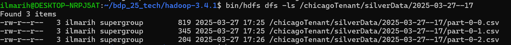

# Assignment 3 Report - Stream and Batch Analytics

## Part 1 - Design for streaming analytics

### 1.1 Dataset for streaming analytics

We are using the same dataset as previously used in this platform, the [2024 Chicago Taxi Trip data](https://data.cityofchicago.org/Transportation/Taxi-Trips-2024-/ajtu-isnz/about_data). The data contains 23 columns, including information about trip start and end times, trip distance, pickup and dropoff locations, taxi ID and total trip cost. The dataset is suitable for streaming data analytics as it can be used to simulate data streaming of taxi trips, which is a domain that generates continuous high-volume data in real time and can highly benefit from streaming analytics. The data requires immediate processing and insights to optimize the taxi business. For example, Uber handles very high volumes of data streams every day and has engineered their in-house streaming analytics platform called AthenaX to utilize the streaming data. The dataset contains potential streaming and batch (historical) analytics possibilities, which can be used to optimize the business of the taxi service provider tenant.

The component **tenantstreamapp** analyzes raw streaming data from the tenants. The component ingests raw taxi trip data from Kafka producers and produces *silver data*, which is by cleansing the data by removing invalid records e.g. without essential values. The trips are aggregated by location and time. The streaming analytics would include real-time demand analysis, where analyzing trip pickup locations would enable dynamic pricing. The component would identify high-demand areas in real-time. Other analytics could contain average number of trips per vehicle, aggregated total fates, estimated hourly revenue per vehicle, number of trips in some time window. The silver data is generated to csv files and the data sink is HDFS.

The batch streaming analytics component is **batchstreamapp** uses workflow model and analyzes the historical silver data outputted by streaming analytics to produce *gold data*. The component processes historical data periodically to generate gold data. The component analyzes larger time scale information from the silver data, with analytics for example about geographical demand areas per week days. The gold data is also stored to HDFS.

The workflow model is the following. Tenant streaming analytics component produces silver data continuously. The batch streaming analytics component schedules periodic processing of the silver data. It performs more complex aggregations and statistical analysis and generates gold data as insights and reports.

### 1.2 Messaging system and stream analytics settings

The streaming analytics component handles streaming data, which can be either keyed or non-keyed. Keyed data means that each data record is associated with a key, allowing grouping, partitioning and stateful processing. With keyeing, the streaming data can be partitioned and processed in parallel. Non-keyed data means that the data is handled as indepentent records, which enables simpler storage but less efficient partitioning and aggregations.

As keyed data allows parallel processing and grouping the data, we key the streaming data by the pickup location. This allows us to enable real-time aggregations per geographical location and generate silver data based on the analytics. Then batch analytics component can more efficiently query the silver data from HDFS to produce gold data based on the demand analytics.

Message delivery guarantee means the assurance the messaging system provides about the delivery and processing of messages. Different levels of guarantees ensure that messages are reliably delivered and not lost, in certain ways. Message guarantees are the job of the messaging system, and processing guarantees are the job of the stream processing components. Message delivery guarantees include exactly once, at least once, at most once. At most once -guarantee means that the message might be not delivered at all, but no duplicate messages is possible. It is good option when duplicate processing is costly/unnecessary, such as logging. At least once -guarantee means that the message delivery is guaranteed, but it might me delivered multiple times in case of errors meaning duplicate data. It is suitable when message loss cannot be tolerated. Exactly once -guarantee is the strictest, as it ensures no message loss and no duplicates. It is used in financial transactions.

In our case, we will use the at least once -guarantee. It means that even in case of failures during message processing, no data is lost.

### 1.3 Data times and windows

The data pipeline in the platform contains several unique times associated with data. One time element is the event time, which means the time the message is produced. This time is automatically stored in the data record with rounded value (15 minutes), as the Trip End Timestamp contains it. Other time element is the time the message is entered into the system. One time element is the time when the data is processed. Because in streaming analytics we are interested in amount of trips per geographical area per some time unit, we use the trip end timestamp in stream processing to aggregate the data.

In stream processing, windows are used to group the data for processing in time-bound chunks. As streams keep producing events indefinitely, windows allow us to divide this continuous flow of data into manageable discrete frames and then process them like batches. Window is a chuch of data.

There are different types of windows, with sliding and tumbling windows being the feasible possibilites in this context. Tumbling window defines a fixed-size, non-overlapping window of data. Once a window is complete, the system moves to the next, window slides forward by the window size. E.g. with 10 minute tumbling window, data would be grouped from 00:00 to 09:59, with next group being 10:00 to 19:59. Used for calculating aggregations of events over fixed time intervals. Sliding window is also a fixed-size window, but it slides over the stream at regural intervals, i.e. windows overlap. A sliding window with a slide of 30 seconds would capture the data from 0:00 to 0:59, 0:30 to 1:29, 1:00 to 1:59. Sliding windows are used for e.g. tracking moving averages, such as computing average temperature in the last 5 minutes, updating every minute.

As we want to calculate aggregations of taxi trips over fixed time intervals, we are using tumbling window. We are yet to determine if use time-based (window of 1, 10, 60 minute?) or count-based (window of 100, 500, 1000 trips?).
We will create 1 hour tumbling window, where taxi trip amounts are aggregated per the location area. After the 1 hour window has passed, the resulting data is stored in the HDFS silver data storage as csv, with each row corresponding to one area.

Out-of-order data records could be caused the taxi trip IoT device failures, network failures etc. This is expected, as the data is coming from distributed sources with unreliable networks.

A watermark is a progress marker for stream processing that helps the system decide when to move forward to avoid waiting indefinetely for out-of-order events. It allows the system to process a late event. As we are calculating amount of trips per area over time we will be using watermarks. The watermark acts as a threshold that marks the oldest event we will still process even if the event is late. 
TODO add watermark info

### 1.4 Performance metrics of streaming analytics

There are several important performance metris for streaming analytics for the taxi service provider tenant. An essential metric is event throughput. It measures the number of events processed per second by the streaming analytics application, indicating how efficiently the system can handle the incoming taxi trip streaming data. We can measure it with Kafka or Flink.

End-to-end latency. Time taken from when event is produced by tenant until it is processed and stored into silver data location in HDFS. It is used to ensure real-time insights are generated within acceptable delays. The real-time analytics are not useful, if they are not provided in real-time also.

Processing time per event. Time taken to process a single event withing the streaming analytics pipeline. It helps in optimizing recources. Ensures system can keep up with incoming data rates.

### 1.5 Architecture of streaming analytics service

Tenant data sources
Messaging system
streaming computing service
tenantstreamapp
tenantbatchapp
mysimbdp-coredms

The platform contains messaging system, of which technology is Apache Kafka. Tenants produce data to the platform by sending data records using Kafka Producers. The messaging system component contains Kafka cluster, to which the tenants producers send data. The streaming computing service of the platform is implemented with technology choice of Apache Flink, which is extremely efficieny for tracking running aggregations and detecting anomalies. The streaming computing service runs Flink cluster (?), and the tenantstreamapp is a Flink job, which is executed in the platforms Flink cluster. The core data management system (coredms) contains two separate data storage components; one for operational data and one for analytical data. The operational data storage is Cassandra cluster, as previously in this platform. The analytical data storage is Hadoop Distributed File System (HDFS). In real scenario a data lake would be more suitable choice for analytical data, but for simplicity we will use HDFS, which is efficient for handling large data and supporting batch analysis. The HDFS storage system is separated into two storages, silver and gold data. Tenantbatchapp is the component, which runs batch data analytics of the silver data and produces gold data. Apache Airflow is used for orchestrating the workflow, scheduling the periodic running of the tenantbatchapp.


The workflow is the following. Tenants produce real time data with Kafka producers producing data into the messaging system. The tenants streaming application Flink job is running on the platform Flink cluster, and consuming the streaming data of the tenant. The tenantstreamapp processes the data by cleaning it and stores the processes data into mysimbdp-coredms Cassandra cluster. At the same time, the tenantstreamapp is producing silver data, i.e. running aggregations of taxi trips per area over time on the data. The produced silver data is sent to the tenant in real-time and stored to the analytical data storage HDFS silver data st0rage. Tenantbatchapp runs periodically and consumes the silver data, generates gold data from it and stores the gold data into analytical data HDFS gold data storage.

## Part 2 - Implementation of streaming analytics

### 2.1 Tenantstreamapp

Input streaming data has the following schema:

```json
{
  "Trip ID": "0000184e7cd53cee95af32eba49c44e4d20adcd8",
  "Taxi ID": "f538e6b729d1aaad4230e9dcd9dc2fd9a168826ddadbd67c2f79331875dc586863d73aa3169fb266dc5e5ed6cdc8687537de8071a51556146f5251d4d8e8237f", 
  "Trip Start Timestamp": "2024-01-19T17:00:00Z", 
  "Trip End Timestamp": "2024-01-19T18:00:00Z", 
  "Trip Seconds": 4051, 
  "Trip Miles": 17.12, 
  "Pickup Census Tract": 17031980000, 
  "Dropoff Census Tract": 17031320100, 
  "Pickup Community Area": 76, 
  "Dropoff Community Area": 32, 
  "Fare": 45.5, 
  "Tips": 10.0, 
  "Tolls": 0.0, 
  "Extras": 4.0, 
  "Trip Total": 60.0, 
  "Payment Type": "Credit Card", 
  "Company": "Flash Cab", 
  "Pickup Centroid Latitude": 41.97907082, 
  "Pickup Centroid Longitude": -87.903039661, 
  "Pickup Centroid Location": "POINT (-87.9030396611 41.9790708201)", 
  "Dropoff Centroid Latitude": 41.884987192, 
  "Dropoff Centroid Longitude": -87.620992913, 
  "Dropoff Centroid  Location": "POINT (-87.6209929134 41.8849871918)"
}
```

For the tenantstreamapp to be able to correctly generate the analytics from the streaming data, the input data must contain the following values. Pickup community area is essential, as it is used for the main analytics, which is the number of trips per pickup area over time. Obviously, the trip start time is also crucial. Other value used for the analytics is the trip total fare, but it is not enforced, as the main on-demand analytics can be generated without the trip costs. The times are expected to be in format "2025-03-27T09:59:22Z", from where it is assigned as the timestamp and changed to integer timestamp format.

The generated output analytics silver data is in following format:

| pickup location  | amount of trips | total fares | start          | end            |
|-----|----------|-----------|---------------|---------------|
| 32   | 7       | 252.50    | 1743076720000 | 1743076720000 |
| 2   | 2        | 22.15    | 1743076720000 | 1743076720000 |

The data is inserted into the silver data storage without the headers.

The input data from Kafka producers is serialized into bytes. The tenantstreamapp Flink application deserealises the data into string format, without enforcing any schema. Then the tenantstreamapp validates the schema, by checking if the data contains the needed values. If trip total is missing, it is simply inserted to 0. After generating the analytics over the tumbling window, the resulting Flink Row-format data is serialized into string-format, and inserted into the HDFS silver data storage.

TODO data sent back to tenant

### 2.2 Tenantbatchapp

The tenant implementation for batch analytics is the tenantbatchapp component, which is a Spark job. The component takes as input the generated silver data and produces gold data, which is more defined analytical data. The component sums up the fares and number of trips of the silver data. The batch analytics service provided by the platform is implemented with Apache Spark, which is a distributed computing framework for fast and large-scale data processing, especially for batch workloads. The platform hosts a Spark processing engine, and the tenantbatchapps are executed by submitting the application as Spark job to the platform engine. The tenantbatchapp is ran periodically. The component consumes all the latest generated silver data from the HDFS silver data storage. An example configuration could be that tenantstreamapp produces silver data records, which contain taxi trips statistics of an 1 hour window of different locations. Then the batch analytics component could consume the generated silver data every 24 hours, generating more detailed taxi trip statistics, enabling more in-depth, long term analysis.

The batch analytics component workflow is the following. First the platform checks for new untouchable input silver data from HDFS silver data storage. If new data is not found, the platform will stop the workflow exetution, and wait for predefined time interval, before starting the workflow again. In this small scale context, we will halt for 1 minute, but in production the interval could be for example from 10 minutes to 1 hour. If new input data is found, the workflow stores the file locations, and moves the execution to the tenantbatchapp-component, which gets the input files. Then the tenantbatchapp job is submitted to the Spark engine with the input files. After the batch analytics component has produced the gold data, the final workflow step begins. In this step the platform modifies the processed silver data file names to include a mark, that the file is processed. The file name will be transformed from "silverdata.csv" to "silverdata_processed.csv". This last step makes sure that the tenantbatchapp does not process the same silver data twice and produce incorrect, misleading analytics.

The underlying workflow orchestrator is implemented with Apache Airflow, which is a platform for automating and managing data pipelines. Airflow works by concepts of directed acyclic graphs with each task containing possible dependencies to others. The batch analytics workflow is defined in Airflow, and it is scheduled to run every minute. Again, of course, in a real production environment this schedule would be different.

### 2.3 Performance testing

The test environment for testing the streaming analytics contains tenant data producers, tenantstreamapp, coredms analytical data storage HDFS for silver (and gold data). The streaming data is simulated by reading the Chicago Taxi Trip data and sending data row by row to the Kafka topic. As the timestamps of the dataset are rounded to fiveteen minutes, for more realistic scenario we will use the current time minus fiveteen minutes for the trip start time. The end time will be the current time, which means that each trip is 15 minutes long, but as the end time is not used the in the analytics this uncommonness wont matter.

As the main focus of this testing is the streaming analytics, we will not be storing the operational data into Cassandra data storage, and we will not be performing the batch analytics.

We have the following configurations:

* 2 kafka brokers
* topic partioined into 2
* replication factor of 2
* flink job parallellism of 1

We will start the testing by using 1 producer producing record of data every second. The output silver data should contain close to 60 total trips per one output file. We use tumbling window of 20 seconds.

After producing for 104 seconds, with 100 messages sent, we have the following silver data:


The contents of one file were:


| pickup location  | amount of trips | total fares | start          | end            |
|-----|----------|-----------|---------------|---------------|
|8|4|49.42|1743088220000|1743088240000|
|76|3|252.88|1743088220000|1743088240000|
|56|1|58.5|1743088220000|1743088240000|
|28|2|54.2|1743088220000|1743088240000|
|21|1|3.25|1743088220000|1743088240000|
|50|1|31.75|1743088220000|1743088240000|
|22|1|32.75|1743088220000|1743088240000|
|38|1|30.5|1743088220000|1743088240000|
|32|5|nan|1743088220000|1743088240000|

We can see that the total number of trips was 19, which is expectable in the 20 second tumbling window.
CPU and memory usage both rose up approximately 10 %.

For the next test, we will use tumbling window of 60 seconds, 1 producer producing two messages per second.
mem 74, cpu 20

After running for 150 seconds, we have tree silver data outputs as expected. Each contains the expected data. CPU and memory rose up the same 10 %.

Next test will be 2 producers producing 10 messages a second (20msg total / s).

After running for 120 seconds, output files are as expected. CPU and memory again 10 &.

Next test will be 5 producers, each producing 10 messages a second (50 msg total / s)
After running for 2 minutes.
CPU raised 20 %.
The data is starting to show meaningful statistics:

Top areas:

| pickup location  | amount of trips | total fares | start          | end            |
|-----|----------|-----------|---------------|---------------|
|76|273|nan|1743090780000|1743090840000|
|32|183|nan|1743090780000|1743090840000|

Opposed to lowest:

| pickup location  | amount of trips | total fares | start          | end            |
|-----|----------|-----------|---------------|---------------|
|15|1|31.25|1743090780000|1743090840000|
|30|1|12.75|1743090780000|1743090840000|

Next test 5 producers producing 20 messages a second (total 100 msg / s)

CPU rose up to 50 %. 

Next test 5 producers producing without sleep

Aftering producing for a little over 2 minutes, the platform started to halt. As we are running locally, we cannot say which component was the first to freeze. It is Kafka or the Flink. But, because HDFS contains only 2 silver data files, we can assume that the flink job freezed as it should have started writing to the third file as the third window was started. 

The CPU raised up to 100 %. Memory raised only 10 %.

The log file *silver_data_final_test.log contains the result of second of the silver data outputs. The most number of trips per area was approximately 8500, while the lowest has single ones. In this kind of small simulated test environment where the tests were run for couple of minutes, not very detailed analytics can be made (can't take into account real time of trip, events in the city, weather etc.), but this shows that if the silver data was for example for 15 minutes of trips, the data would contain useful information for analytics.


### 2.4 Wrong data

As the analytical data needs pickup location area and trip start timestamp, we will simulate situtation where wrong data is sent to the platform in different amounts. As the streaming analytics component is made in a secure way, all the data it needs (pickupp location, timestamps) are verified to be in the input data. If the input data is missing those or they are in wrong format, the component will ignore the record. We will show it.

First we will send data that is missing pickup location area.

Then we will send data that is missing start timestamp.

Then we will send data that has pickup location as int instead of string.

Then we will send data that has timestamp as empty string.

First we will send data where every 10th record has no pickup area location

Then we will send data where every second record has no start timestamp

Lastly, we will send data where every row is missing

### 2.5 Performance with tenantstreamap parallellism configurations

## Part 3 - Extension

### 3.1 API for batch data ML

### 3.2 Bounded data tenantbatchapp trigger

### 3.3 Critical condition detection architecture

### 3.4 Different schemas

### 3.5 End-to-end exactly once delivery